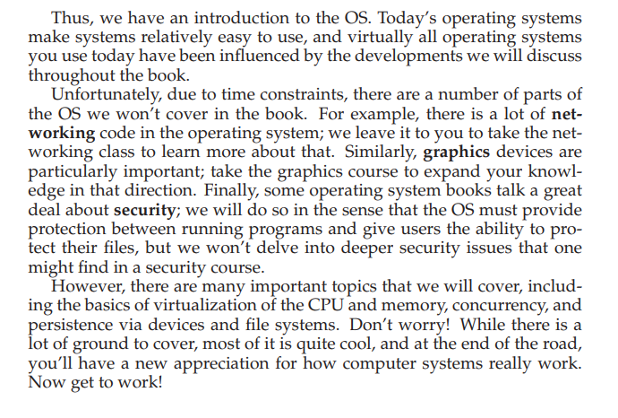

## 操作系统(一)
## 王道烩 2018.9.19

### 程序执行

程序运行就是执行指令的过程。处理器从内存中取一条指令，然后解码，并执行它。
执行完一条指令之后执行下一条指令。

### 操作系统的主要功能

#### virtualization

操作系统主要的功能是虚拟化资源。操作系统将物理资源转换成更加通用更加有力更加方便使用的虚拟资源。操作系统向我们提供一系列的系统调用，system calls,供我们来使用物理资源。有时应用程序也将操作系统称为standard library。

同时操作系统使得多个程序能够同时执行。操作系统也是一种资源管理器。对于CPU,Memory以及Dsik这些资源，操作系统需要高效地管理这些资源并进行合理地分配。

#### Virtualizing The CPU

操作系统能够将物理CPU虚拟成很多的CPU，这体现在很多程序能够同时运行，好像有很多CPU一样。在有很多程序需要运行的时候，运行哪一个程序需要用操作系统的policy。

#### Virtualizing Memory

在一台实体计算机中，物理内存是一定的，但是为了向程序员透明，操作系统将物理内存虚拟化成虚拟内存。每一个程序面向的内存是同一块内存，而且能够比真的实际物理内存更大。操作系统主要将虚拟内存映射成物理内存。这样能够使得各个程序的虚拟内存空间之间相互隔离。

#### Concurrency

操作系统需要解决的另一个问题就是**并发执行**的问题。

当多个程序同时执行的时候，会同时导致一些非常有趣的问题。比如共享变量的问题。多线程的操作系统能够同时访问一片内存区域，共享内存资源，但是如果不将这些共享资源保护起来的话，在程序执行的时候会出现很多问题，尤其是在程序之间进行切换的时候。

#### Persistence

计算机内存之中的内容在断电之后就会消失，为了将信息存储起来，需要将内存中的东西存到外存中。这就包括各种I/O设备，以及文件系统。同时我们也能够通过系统调用来管理文件系统。

#### Summary

