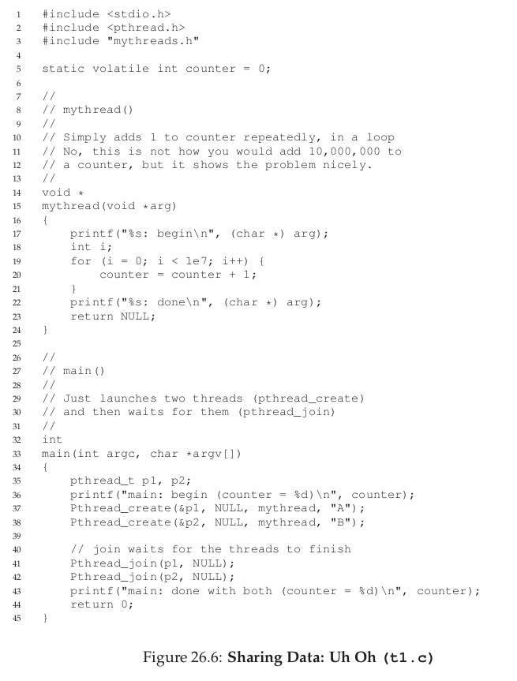
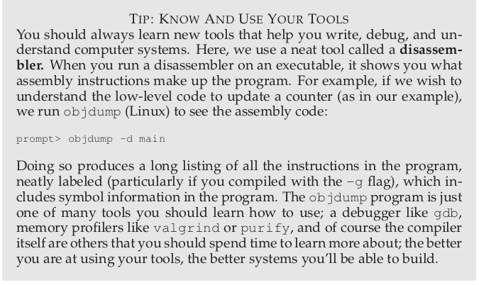
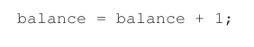

## 操作系统(十)
## Wednesday, 03. October 2018 10:03AM 

### 1 Concurrency: An Introduction

下面要引入**线程(thread)**的概念。除了传统的一个进程只有一条线在执行之外，**多线程进程(multi-threaded)**同时有多条线在运转。另一个角度理解线程就是，线程就向一个独立的进程，但是和进程不同的是，线程之间能够共享同样的地址空间因此能够访问同样的数据。

一个线程的状态和进程是非常像的。每一个进程有自己的program counter (PC)，用来记录程序取指令的地址。同时，每一个线程有自己的私人的一组寄存器用来计算，所以如果单核CPU运行了两个线程，那么在进行线程切换的时候，需要进行上下文切换。所以我们需要多个**线程控制块(thread control blocks(TCBs)**来记录一个进程的每一个线程的状态。但是线程上下文切换和进程不一样，线程上下文切换不需要改变地址空间，因为它们共享内存。

同时线程和进程之间的不同是栈。传统进程地址空间中只有一个栈，但是多线程进程中，每一个线程都有一个栈，因为每一个线程都可能进行函数调用。所以多线程进程的地址空间会有所变化。

#### 1.1 Why Use Threads?

主要有两个原因。第一个是并行执行**parallelism**。如果一个操作同时执行能够提升效率的话，那么这不失为一种好的方法，比如GPU的运算。同时由于现在的多核CPU，使得并行执行是一种让程序运行更快的一种非常自然的方式。

第二个原因是为了避免有执行I/O而阻塞进程的执行。在执行I/O的时候，进程可能希望执行其他的事情，比如用CPU进行一些运算，或者甚至提出更多的IO请求。

采用多线程比多进程最大的优点就是线程之间能够共享数据，同时线程切换的时候上下文切换的消耗是进程之间切换小很多的。

如果一个进程中创建了两个线程，那么主线程，两个子线程他们之间的调度关系是不确定的，只能是操作系统来判断。但是这写不确定的因素可能会导致我们程序运行结果的不确定性。

#### 1.2 Why It Gets Worse: Shared Data

举一个简单的例子，一个主线程，定义了一个全局变量，然后这个主线程创建了两个子线程，子线程内部分别执行一个循环，将这个全局变量的值每次加1，直到加到10000.最后主线程调用一个函数`pthread_join()`来等待两个子线程结束后再继续执行，这时输出的全局变量的值应该是20000，但是结果却什么都可能。

其实核心问题就在于不可控的调度。考虑下面这种情况，如果想要将一个内存中的数加1，需要的汇编指令有三条，第一条将这个内存的数据加载到寄存器中，然后将这个寄存器的值加1，然后将这个寄存器的值写会内存中。

那么问题就来了，当一个线程已经将内存中的数据取出来了，然后并进行了加1的操作但是这个时候，发生了中断，OS将另一个线程调度执行了，这个线程同时也是将一个数据取出，加1并写回了，这个时候→被中断了，最开始的线程又开始运行起来，这个时候再将自己的写会操作执行了，这样这个全部变量就行相当于少加了一次！！

**race condition or data race**：结果取决于代码的调度顺序。
**critical section**：如果执行某段代码会导致race condition，那么这段代码就是critical section。

**mutual exclusion**：互斥，一个线程执行critical section的时候，另一个线程不能够执行。

#### 1.3 The Wish For Atomicity

解决上面问题的方法最简单的就是原子操作。如果存在一条指令直接将内存中的一个数加1，那么就不会出现上面的情况。原子操作意味这**all or none**。如果一些指令作为一些原子操作，那么这些指令要不全部执行，要不完全不执行，不可能执行到中间指令的时候发生中断而停止。

但是每种操作都要定义一组原子操作对于硬件来说是太恐怖了，所以我们可以使用一些比较少的原子操作，叫做**synchronization primitives(同步原语)**，通过这些硬件同步原语的组合，我们能够将多线程进程进行很有效的控制。

#### 1.4 One More Problem: Waiting For Another

在多线程问题中，我们不仅面临这共享资源的问题，同时还面临这先后顺序的问题，有时我们希望某些线程按照某种固定的顺序来执行，比如一个线程必须等待另一个线程执行结束才能够执行。这个时候需要的就是**condition variable(条件变量)**。

#### 1.5 Summary

### 2 Locks

从上面的介绍中我们知道一个基本的问题就是，我们希望一些代码能够像原子操作一样，但是由于单核CPU的中断，我们需要采取一些措施。我们可以使用一种叫做**Lock**的东西来解决这个问题。

critical section是每个线程访问临街资源的那段代码，比如将某个共享变量加1，更新链表或者其他的复杂的数据结构。

为了增加一个Lock，我们需要在critical section两端加上这些一样的代码：

一个Lock就是一个变量，当没有线程锁上时，它的状态是availalbe，unlocked or free的，当有线程锁上的时候，它的状态是acquired.locked or held。同时Lock还会存储一些其他的信息，比如，当前是那个线程拥有这把锁，或者一个请求锁的线程队列。但是这些信息对于锁的用户来说是透明的。

当一个线程调用lock()试图得到这把锁的时候，如果没有其他线程拥有这把锁，这个线程就能够得到这把锁然后进入critical section。如果其他线程调用lock()，如果这把锁被别的线程占有的时候，将不会返回。当一个线程占有这把锁的时候，其他线程被阻止进入critical section。

当一个线程调用unlock()的时候，现在这把锁又是可用的了。如果没有线程在等着这把锁，这把锁的状态会变成free。如果有线程在等待这把锁，那么这些线程中的一个会收到这个消息，得到这把锁，进入critical section。

通过增加lock，我们能够在一定程度上控制操作系统的调度。

#### 2.1 Pthread Locks

POSIX library使用的锁的名字是**mutex**。它被用来在进程之间提供**mutual exclusion**。如下所示：

可以使用不同的locks来保护不同的变量。这样能够增加并发度。

#### 2.2 How To Build A Lock

已经从代码层面了解了一个lock是怎么工作的。但是我们如何构造一个lock呢？需要硬件以及操作系统的哪些支持呢？

同时需要考虑性能如何。首先能够实现最基本的功能，其次是否公平，是否会产生饥饿，最后需要考虑性能怎么样，这个lock的使用在各种情况下对熊的负载增加如何？

#### 2.3 Controlling Interrupts

最开始的解决方法是使用关中断的方法。这种方法主要适用于单核CPU。

当我们在一个单核CPU上运行的时候，通过关中断的方法，可以保证运行在critical section的代码不会被中断，然后就能够像原子操作一样被执行。当结束的时候，重新使能中断，然后程序就能够正常的运行。

这种方法的优势就是简单，但是有非常多的缺点。首先程序员能够通过这种方法来一直获得CPU时间。其次，这种方法在多核CPU上是没法正常工作的。同时，关中断会导致中断丢失，比如外部设备的IO完成，操作系统页无法唤醒被IO阻塞的进程。最后，这种方法也是非常不高效的。

所以综上来说，关中断是一种非常不好的方法。

#### 2.4 A Failed Attemp: Just Using Loads/Stores

首先我们先用一种比较简单的方法，使用一个变量来进行加锁。当要进入crtitical section的时候，将一个变量置成1，然后出来的时候，将这个变量置成零。

当一个线程想要得到一把锁的时候，就会一直检查一把锁是否是0，这中方法是**spin-wait**。一直执行一个循环。

这种方法首先的问题是不能够实现最基本的功能**mutual exclusion**。考虑下面的情况：

这个时候同时有两个线程在critical section。

同时这种方法还存在着效率的问题。当一个线程占据了critical section的时候，被挂起了，另一个线程请求这个critical section。但是由于被上一个线程占据了，所以只能忙等待，一直执行循环，但是这样反而会加剧情况的糟糕，因为上一个线程得不到运行，这个线程就永远不会得到critical section。

#### 2.5 Building Working Spin Locks with Test-And-Set

因为上面的两种方式都不奏效，所以操作系统寻求硬件的帮助。一个bit的硬件支持，也别叫做**test-and-set instruction**or**atomic exchange**。这个指令的作用是，检测一个bit，并将将其设置为传入的bit，返回初始的值。

但是这些操作都是在一步完成的。

通过一步设置一个bit的值，能够实现最基本的**mutual exclusion**。

首先上面的方法是正确的，能够是先最基本的lock的功能。其次，上面的方法有可能导致饥饿，当一个线程占着锁不放的时候，其他线程都会一直得不到锁。最后，这种方法是效率非常低。如果一个线程占据了这把锁，那么其他希望拥有这把锁的线程被调度之后只能忙等待，浪费完自己的时间片，直到再次调度到占有锁的线程执行完，释放了锁，其他线程才可能能够运行。

#### 2.6 Compare-And-Swap

另一种做法是，将一个变量的值和某一个值对比，如果相等，就将这个变量赋予另一个值，否则不操作，然后返回原始值。

其余的代码和上面一样，这种方法明显是能够生效的。

#### 2.7 What Now ?

上述的方法主要面临的问题就是轮循的问题。如果有N个线程请求一把锁，那么将会浪费掉N-1个时间片。如何能够解决轮循的问题呢？单独硬件无法解决这个问题，需要操作系统的帮助。

#### 2.8 A Simple Approach: Just Yield, Baby

一种最简单的方法是，一个线程发现锁被别人占用了，就主动放弃CPU，将其让给别的线程使用。这种方法确实能够解决spin的问题，但是还是存在的非常大的效率问题，首先如果有非常多的线程的话，上下文交换的开销还是不小的，其次，这种方法没有解决饥饿问题。

#### 2.9 Using Queue: Sleeping Instead Of Spinning

可以通过增加一个queue，将请求锁的线程放到这个队列中，这样可以比较好的解决上面的问题。

#### 2.10 Summary

