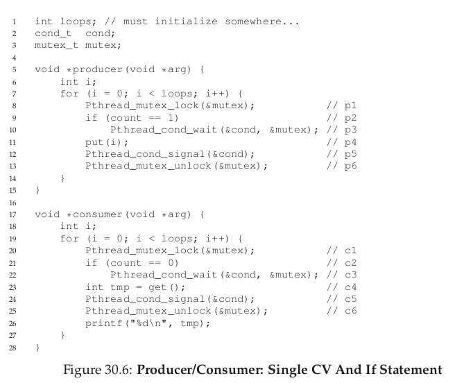
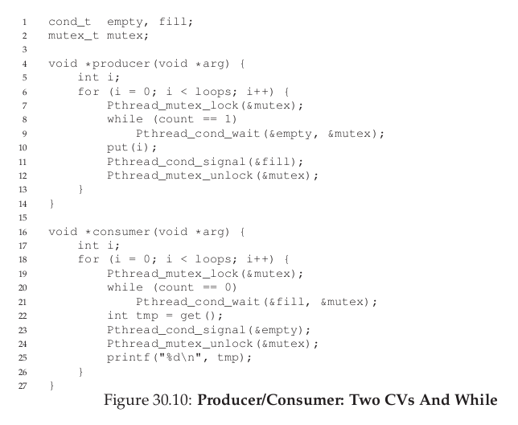

## 操作系统(十一)
## 王道烩 2018.10.4

### 1. Lock-based Concurrent Data Structures

下面主要讨论在一些数据结构中增加锁来增加线程安全性。

#### 1.1 Concurrent Counter

最简单的数据结构就是计数器。

#### 1.2 Concurrent Linked Lists

#### 1.3 Concurrent Queues

#### 1.4 Concurrent Hash Table

ead of having a single lock for the entire structure, it uses a lock per hash bucket (each of which is represented by a list).

#### 1.5 Summary

### 2 Conditional Variables

有些情况下，一个线程需要检查是够一个条件满足，然后再继续执行。例如，一个父线程希望检查子线程是够执行完毕，然后再继续执行，如何能够让父线程等待呢？

我们可以尝试使用一个共享的变量，然后这种方法确实能够工作，但是，效率非常低，父线程轮循浪费CPU时间。我门希望有种方式能够让父线程sleep，知道它等待的条件满足。

#### 2.1 Definition and Routines

为了等待一个条件为真，一个线程可以使用所谓的**条件变量(conditional variable)**。一个条件变量是一个队列，线程在一些执行状态不满足的情况下将自己放进去，然后当所谓的状态改变的时候，然后从这些waiting的线程中唤醒一个，然后允许他们继续执行。

一个条件变量有两种相关操作**wait()和signal()**。`wait()`操作是希望让自己sleep，`signal()`操作是网一个线程已经改变了某些状态，然后希望唤醒一个在等待这个状态的一个线程。

#### 2.2 The Producer/Consumer (Bounded Buffer) Problem

下面是经典的生产者消费者问题。

##### 第一种解法使用if判断

上面的代码，当消费者调用`Pthread_cond_wait()`的时候，会自动释放lock。同时，如果生产生调用`Pthread_con_wait()`的时候，会使得sleep的线程状态变成ready，同时也会释放锁。当生产生调用`Pthread_cond_signal()`的时候，会唤醒一个队列中的线程，但是并不会释放锁。

这种方法失败的原因是，虽然一个消费者因为没有资源堵塞了，然后被生产者唤醒了，但是，由于生产者生产的资源被另一个消费者消费了，所以，这个时候如果第一个消费者被唤醒了，就会发现并没有资源可以使用。

##### Better,But Still Broken: While, Not If

解决上面问题有一个非常简单的办法，就是将if改成while。当改成while的时候，第一个消费者唤醒的时候，会再一次检查是否有资源。这样就能够解决问题。但是这个时候还存在着一个bug。这个bug是由于只有一个条件变量导致的。

按照上述的调度流程，到最后，三个线程都会被sleep。产生上述问题的主要原因很明显，就是，一个消费者不应该唤醒消费者，而应该唤醒生产者。这样就可以使用两个条件变量，来实现正确的功能。

上述解决方法能够解决一个缓冲区的消费者生产者问题。

下面介绍能够有很多资源的问题。

#### 2.3 Summary

`wait()`函数原子地执行以下两个操作：给互斥锁`mutex`解锁，然后把调用线程投入休眠，知道另外某给线程就本条件变量调用`signal`函数。

`wait()`函数返回(signal函数导致或者是TMIEOUT)执行两个操作：重新给互斥锁muex上锁；总是再次测试相应条件是否成立(可能发生虚假的唤醒)。

条件变量总是和一个互斥锁与之关联，因为决定等待和信号发送的变量必须用互斥锁保护起来。
