## 操作系统(十二)
## 王道烩  2018.10.5

### 1 Semaphores(信号)

我们可以同时使用locks和condition variables来解决很多相关和有趣的并发问题。但是还有一种同步原语，叫做**semaphore(信号量)**。我们可以使用单独一个信号量来完成所有的事情，可以用信号量来代替lock和condition variables。

#### 1.1 Semaphores: A Definition

一个信号量是有一个整数的一个对象，我们可以有两种操作`sem_wait()`和`sem_post()`。信号量的初始值决定了这个信号量的作用，所以子啊使用之前必须将这个信号量初始化。

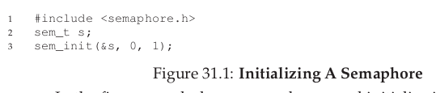

第三个参数表示了整数的值，第二个参数0表示了这个信号量是在同一个进程的线程之间共享。要想让这个信号量能够在不同进程之间共享，可以修改对应的第二个参数。

定义完一个信号量之后，可以使用`sem_wait()`和`sem_post()`来和这个信号量进行交互。两个函数的作用如下：

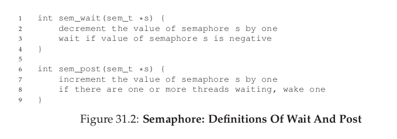

`sem_wait()`将信号量的值减一，如果这个值是负的，就将自己挂起。
`sem_post()`将信号量的值加1，如果有线程在等待，将其中一个唤起。

这两个操作都是原子操作，同时可以知道，信号量如果是负的，那么表表示有几个线程正在被挂起。

#### 1.2 Binary Semaphores(Locks)

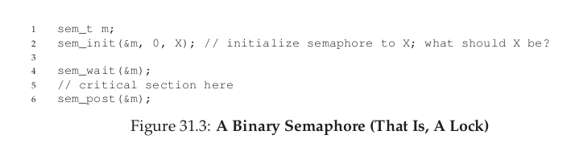

如果将一个信号量的值初始化为1，那么这个信号量就相当于一把锁。

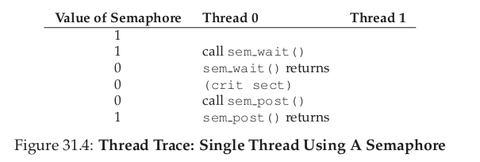

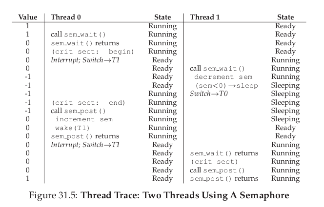

#### 1.3 Semaphores For Ordering

我们可以使用一个信号量来对事情的发生顺序进行调度，有点类似条件变量的感觉。

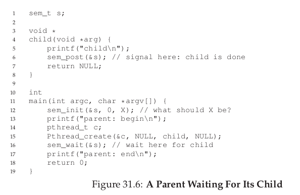

当上面代码中的X是0时，这个程序能够按照想要的来执行。

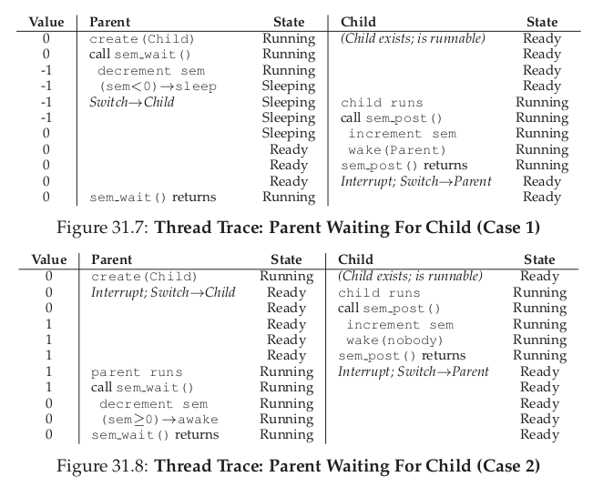

#### 1.4 The Producer/Consumer (Bounded Buffer) Problem

接下来用信号量来解决生产者消费者问题。

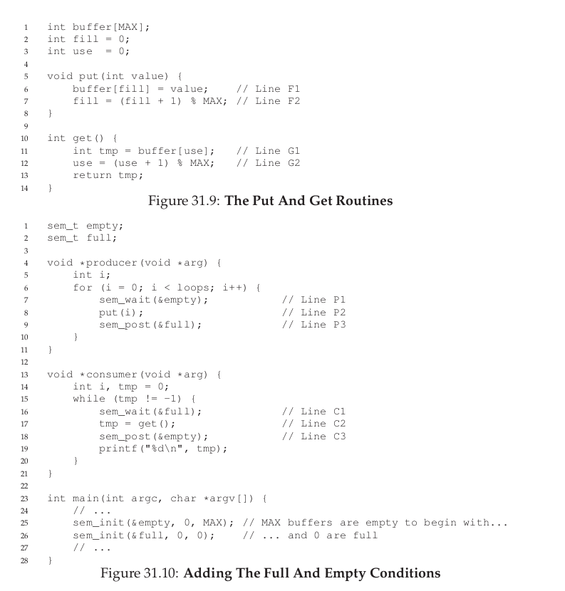

上面的主要问题就是对于共享变量的访问问题。假设empty的值不是1，那么假设一个线程调用了wait,然后发现可以进入，将一个东西放在了第一个位置，但是这个时候发生了中断，这个时候第二个生产者也调用了wait，页进入了这个地方，那么就会将自己写的东西覆盖掉前面的内容。产生这样的问题就是对共享资源没有进行互斥访问，可以通过对共享资源进行加lock来实现。

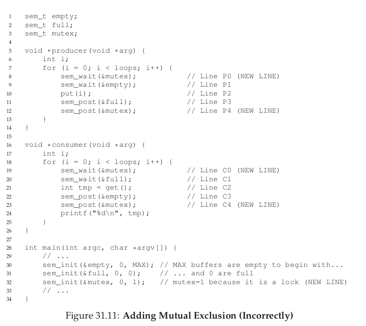

这样就能够得到上面的解决办法，但是上面的解决办法还是不行的，会产生死锁。

假设消费者先执行，这个时候就会被先到mutex这个信号量中，等待一个线程来释放，但是，由于这个线程占据了这把锁，导致其他生产者不能够进入到临界区来生产，这就会导致死锁发生。

通过上述的分析，需要进行的改变就是，将两个信号量的位置进行调换。先对empty和full信号量进行操作，满足条件之后才能够进入临界区。

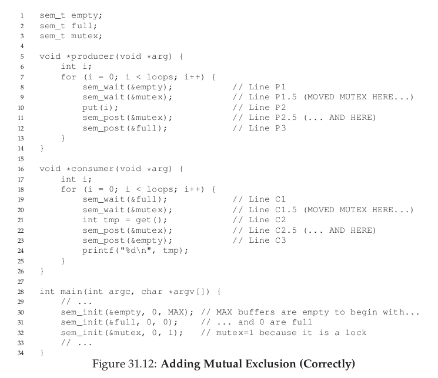

#### 1.5 Reader-Writer Locks

不同的数据结构需要不同的锁。考虑一个链表，只要保证没有插入操作正在进行，那么有多少个查找操作都没有关系。这种类型的锁叫做**reader-writer lock**。

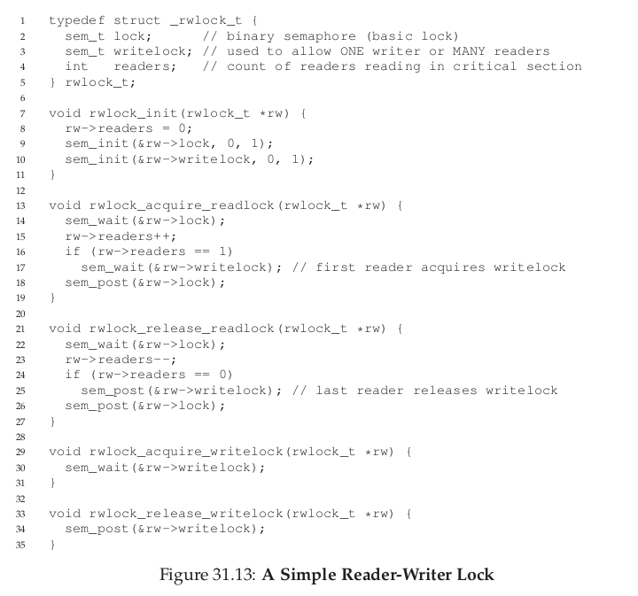

在第一个线程请求读之后，就需要将这个这个数据结构的写锁进行锁住。在最后一个读线程执行结束之后，就需要将写锁释放。

#### 1.6 The Dining Philosophers

下面讨论哲学家进餐问题。一共五个哲学家，没两个哲学家之间有一个叉子，一个哲学家要想吃饭的时候需要将左右两个叉子都拿起，才能够吃饭。如何进行保证？

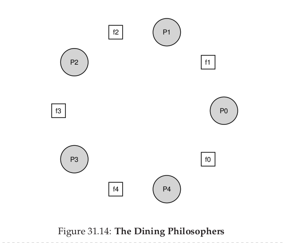

每一个哲学家最基本的动作是下面这个：

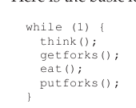

关键的问题是如何写`getfocks()`和`putforks()`两个函数，使得不会产生死循环，不会有哲学家饥饿。

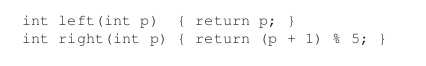

为了使用信号量解决这个问题，我们一共设置5个信号量，每一fork一个信号量。
首先可以采用下面最简单的想法来解决这个问题：

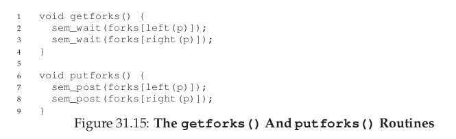

上述解决方法的主要问题是死锁。如果每个哲学家都拿起了左收的叉子，但是现在又想拿右手的叉子，那么谁都拿不到。

一种简单的方法是打破这种依赖，让一个哲学家拿叉子的顺序是不同的。

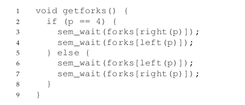

通过上面的解决方法，不可能同时存在五个哲学家每个人都拿一个叉子请求另外一个叉子的情况，这个问题就得到了解决。

#### 1.7 How to Implement Semaphores

那么如何能够实现信号量呢，可以使用lock和条件变量来实现：

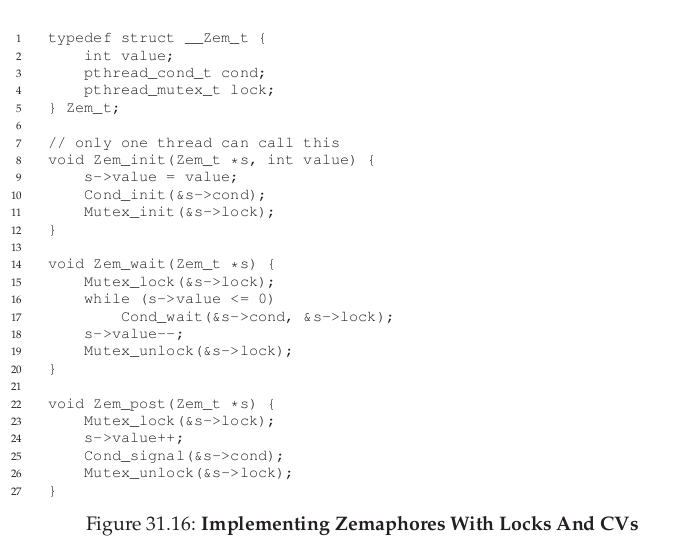

#### 1.8 Summary

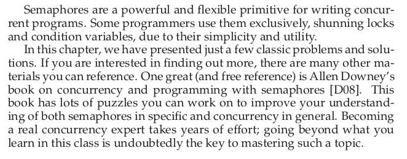

### 2 Common Concurrency Problems

在通常的并发问题中存在这一个共性的BUG，以前主要的关注点在死锁，但是要有一些其他的BUG。

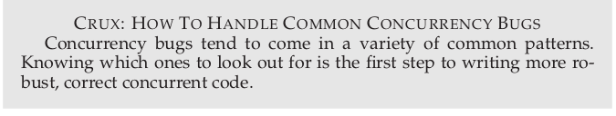

#### 2.1 What Types Of Bugs Exist?

首先的问题是，通常什么样的BUG会存在。主要的研究方向在于开源的应用中，如MySQL，Apache，Mozilla，OpenOffice。

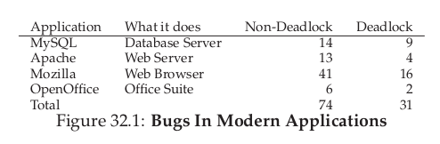

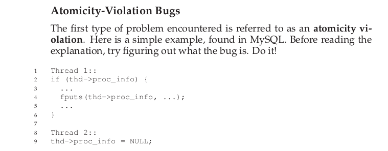

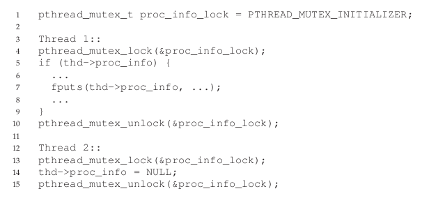

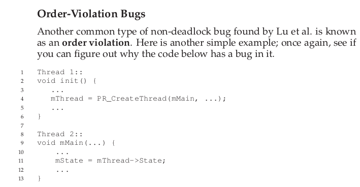

上述主要问题是线程2假设线程1已经运行了，所以需要将两个线程同步，同步的话可以使用条件变量或者信号量来实现。

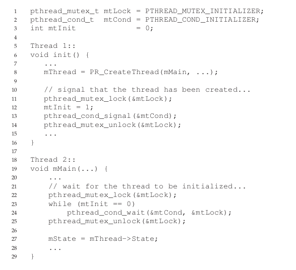

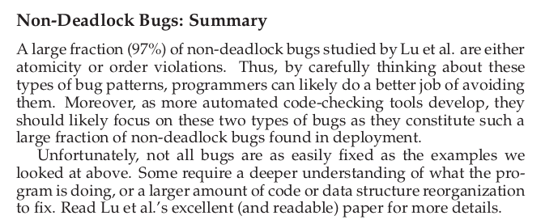

#### 2.2 Deadlock Bugs

死锁发生的主要原因是因为存在循环依赖的现象：

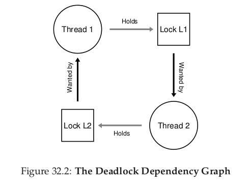

线程1拥有资源1请求资源2，线程2拥有资源请求资源1.

主要是有大量的代码，复杂的依赖，这样使得解决死锁是十分困难的。还有就是封住的问题，由于软件开发员喜欢隐藏实现细节，所以导致死锁的发生。

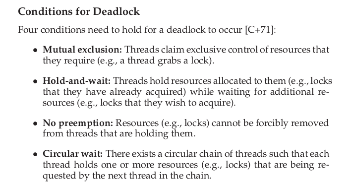

上面四个条件只要有一个不成立，死锁就不会发生。

#### 2.3 Summary

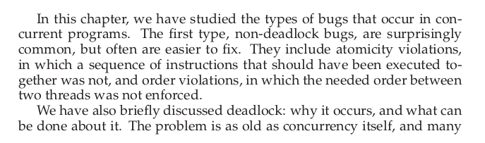

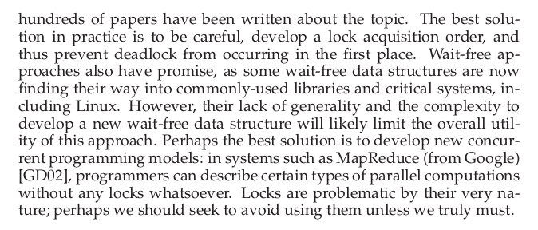

