## 操作系统
## 王道烩 2018.10.11

### 1 I/O Devices

IO设备对于操作系统来说是非常重要的。那么操作系统是如何将IO整合到系统当中的呢？

#### 1.1 System Architecture

下图是传统的系统结构：

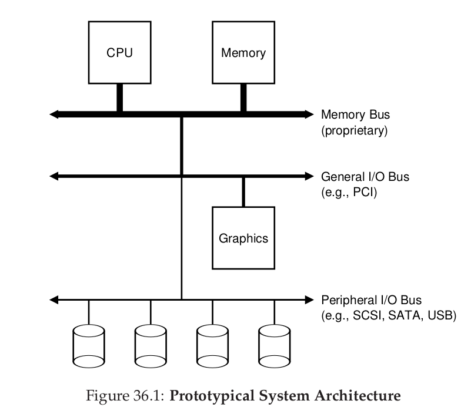

其中的memory bus连接CPU和主存。I/O bus连接图形处理设备或者其他的高性能的IO设备。Peripheral bus用来连接低速的设备，比如disks，mice，以及keyboards。

为什么需要这样的金字塔结构呢？首先是速度问题，有些设备和CPU之间进行交互多，有些则非常少，其次是价格问题，速度要求越高价格越贵。

下面是现代操作系统的结构：

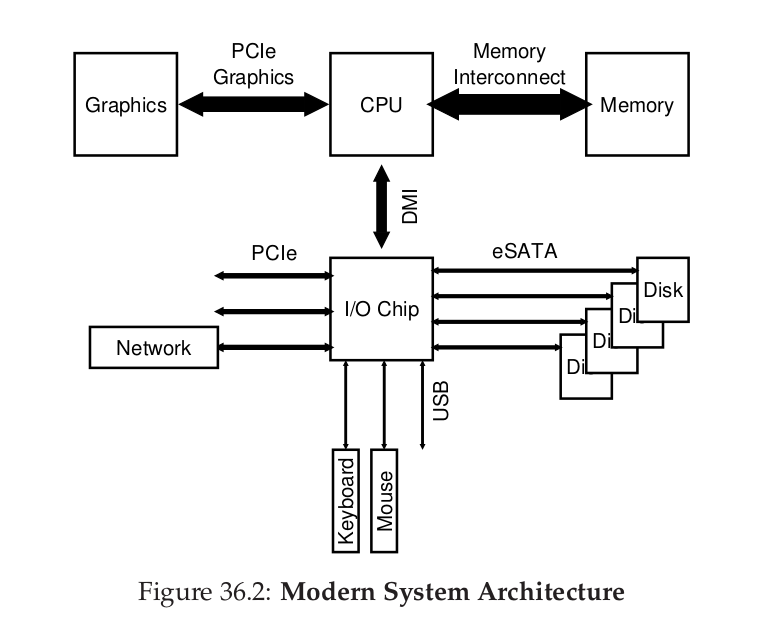

操作系统和IO Chip进行打交道。

#### 1.2 A Canonical Device

首先看一个虚拟的设备结构。

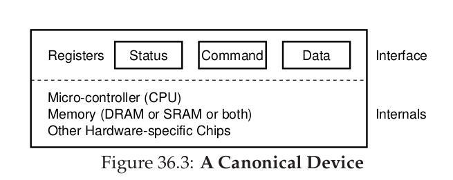

包括两部分的结构。第一部分是**hardware interface**,为系统软件控制这个硬件提供一些接口。第二部分是**internal structure**。这一部分负责设备为系统提供的功能的具体实现。这一部分可能包含一个CPU，一个比较小的memory或者其他的芯片。

#### 1.3 The Canonical Protocol

- Status register：可以读取来获得设备当前状态。
- Command register：告诉设备要执行的任务。
- Data register：将数据传送给设备或者从设备获得数据。

通过读取设备为操作系统提供的上述接口，操作系统能够控制设备的行为。

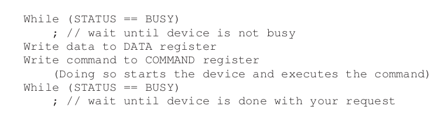

上述方法是一种**polling(轮循)**的方法。然后当CPU负责数据移动的时候，我们称为**programmed I/O(PIO)**。

上述协议主要好处是简单，但是效率非常低。主要是利用轮循以及PIO的方法，浪费了大量的CPU资源。

#### 1.4 Lowering CPU Overhead With Interrupts

为了减少轮循带来的问题，可以使用中断的处理方式：

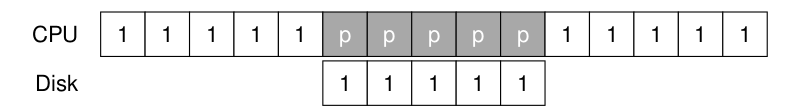

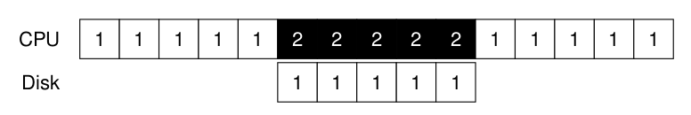

#### 1.5 More Efficient Data Movement With DMA

为了减少PIO的问题，我们采用**Direct Memory Access(DMA)**。DMA对于一个系统是必须的，它能够在没有CPU过多干预下在device和main memory中进行数据交换。

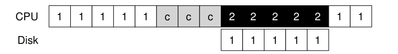

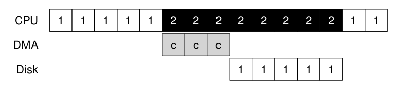

#### 1.6 Methods Of Device Interaction

那么操作系统如何和IO进行交流呢？有两种方法，一种是设计IO指令。每个设备有一个port，然后使用这种特殊的指令，就能够将数据加载到寄存器中。这种指令有优先级，必须操作系统才能够执行这样的指令。

第二种方法是将设备映射成内存中的地址，**memory-mapped I/O**。这种方法的情况下，硬件使得设备的寄存器就像内存地址一样被直接访问。当OS issue一个load或者store这个地址的时候，硬件将load/store设备寄存器而不是main memory。这种好处是不需要添加新的指令。

#### 1.7 Fitting Into The OS: The Device Driver

最后的问题是如何能够适配设备。每一个设备都有不同的借口，但是OS系统能够尽可能通用。如文件系统：SCSI disks、IDE disks、USB keychain drivers。我们希望这些区别对于操作系统来说都是透明的。这就可以使用以前讨论的方法**abstraction**。

在操作系统的low level,有一些代码必须知道一个设备工作的具体细节，这些代码称作**devices driver**，任何详细的设备交互都在这些代码中。

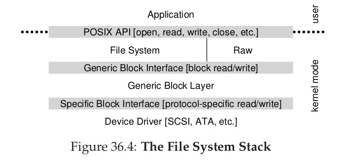

由于任何插入的设备都需要驱动程序，所以驱动程序占整个操作系统代码的大概70%。

#### 1.8 Summary

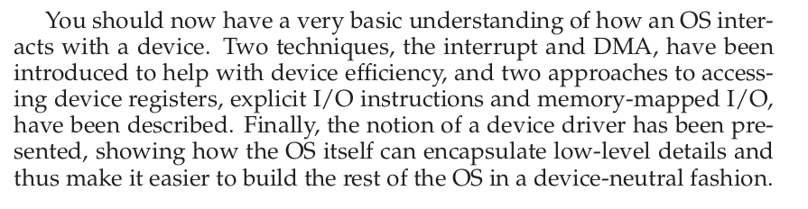

### 2 Hard Disk Drives

现在的硬盘包含大量的扇区(sectors)，一个扇区是512-byte，每个扇区能够被读写。

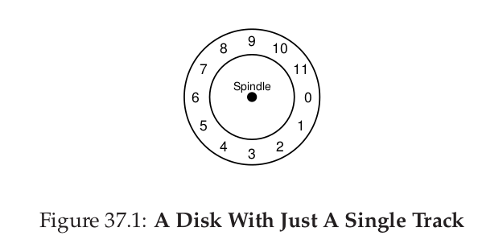

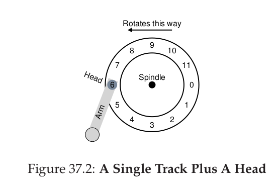

d读写数据一共有三部分延时，寻道，选装延时，转换延时。

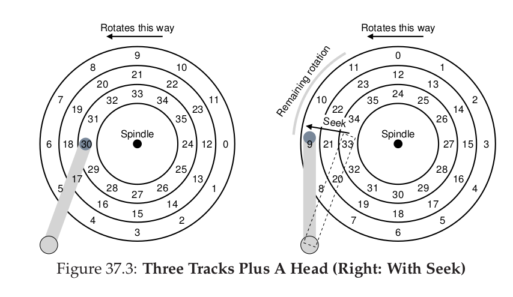

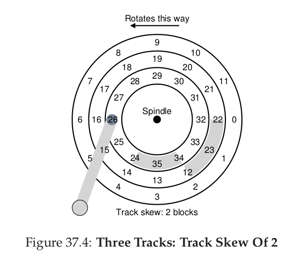

为了照顾到变道延时，内外轨道的相邻扇区编号错开几位。

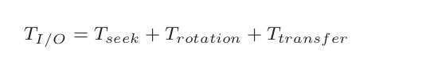

#### 2.1 Disk Scheduling

- SSTF: Shortest Seek Time First

但是上述方法会导致饥饿。可以采用单方向扫描的方法来解决饥饿。

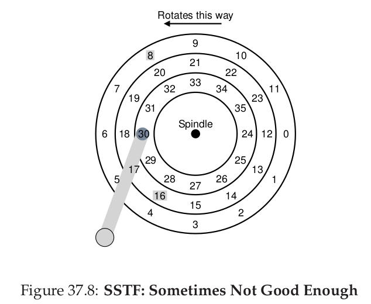

- SPTF: Shortest Positioning Time First

#### 2.2 Summary

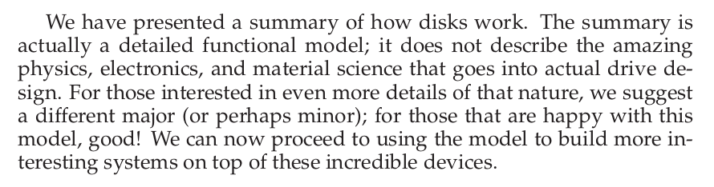