## 操作系统
## 王道烩 2018.10.11

### 1 Redundant Arrays of Inexpensive Disks

通过将多个磁盘放在一起，可以增大容量以及带宽。同时具有损坏修复的功能。在某一块或某几块硬盘损伤之后，能够恢复数据。评价一个RAID可以有三个方面：

- 容量
- 可靠性
- 性能

#### 1.1 RAID Level 0: Striping

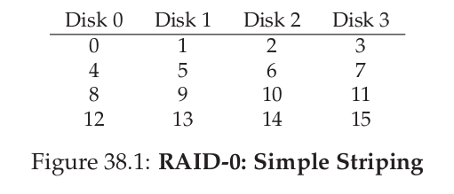

#### 1.2 RAID Level 1: Mirroring

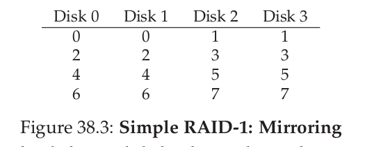

#### 1.3 RAID Level 4: Saving Space With Parity

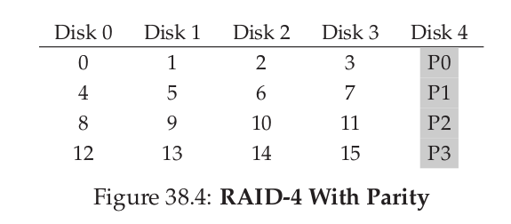

修改策略：

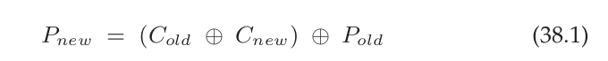

将所有标记位放在一个磁盘会降低带宽。

#### 1.4 RAID Level 5: Rotating Parity

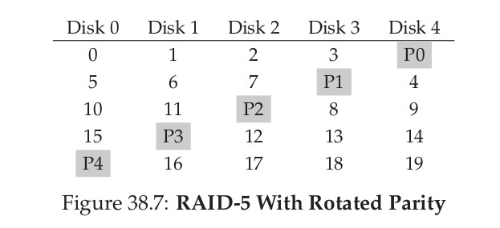

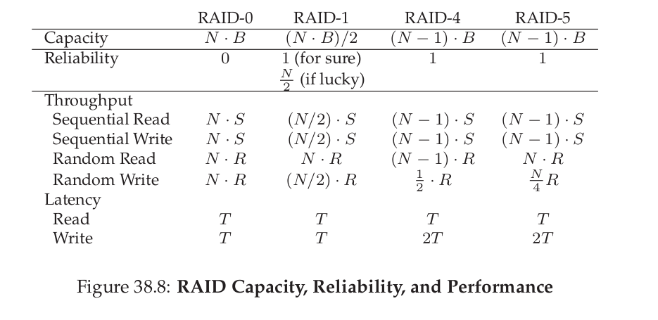

#### 1.5 Summary

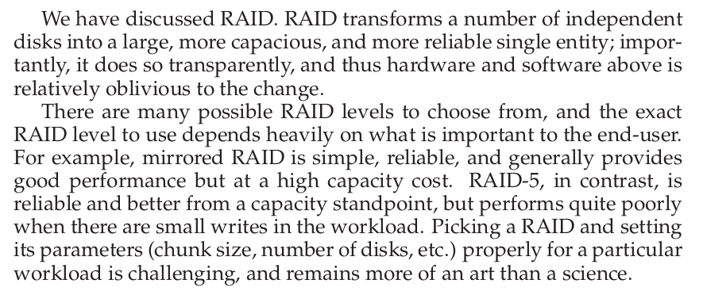

### 2 Interlude: Files and Directories

操作系统该如何管理永久存储设备呢？

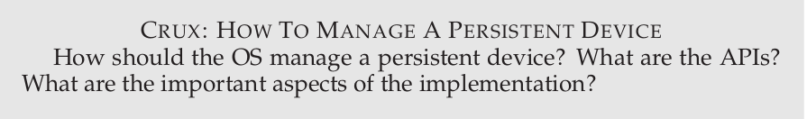

#### 2.1 Files And Directors

在永久存储之中使用的抽象是**file and directory**。每一个文件是一个线性的bytes的数组。每一个文件有一个用户不知道的底层的名字，称为**inode number**。在现代操作系统中，OS对于文件的结构知道的并不是很多。

第二个抽象是**directory**。目录和文件一样，有一个low-level name，也就是inode number。但是它的内容是一些**(user-readable name ,low-level name)**对的列表。将目录放在目录中，就形成了目录树。

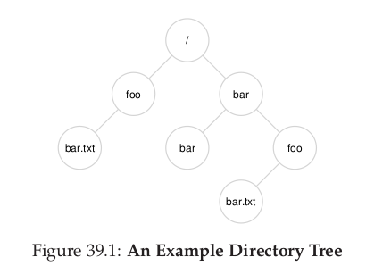

每一个文件有一个name和拓展名。拓展名只是方便表示文件的类型，但不是绝对的。

#### 2.2 Creating Files

硬链接会创建一个inode，但是软链接不会创建inode，只是指向同一个地方。

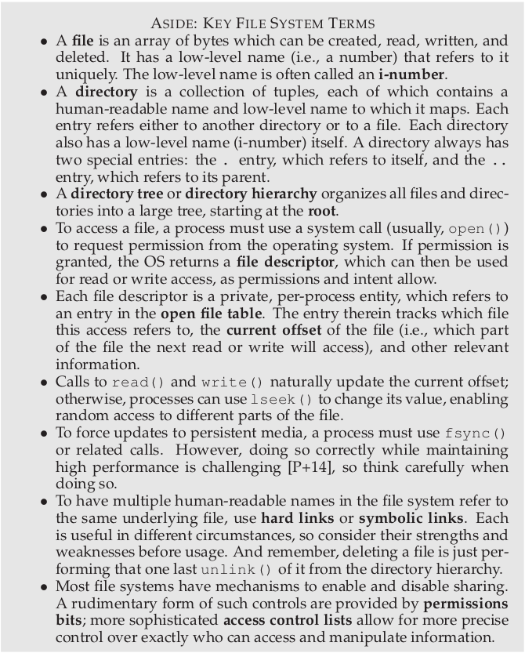

#### 2.3 Summary

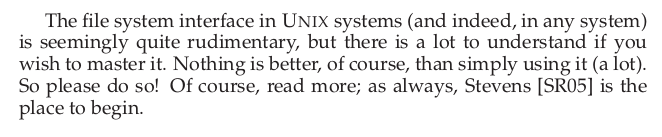