## 操作系统
## 王道烩 2018.10.11

### 1 File System Implementation

首先讲一下**very simple file system(vsfs)**。不同的文件系统具体实现是不同的，但是很多基本概念是想通的。

了解一个文件系统主要需要了解两个部分，一个是数据结构，文件系统是如何阻止它的数据的，第二个是访问方式**access methods**。当一个系统调用发生的时候，是如访问需要的文件的。

#### 1.1 Overall Organization

首先将银盘分成很多块儿，一块儿的大小是4KB。每一个文件系统大部分空间是存放数据的称为**data region**。然后需要一个空间存放inode，这些称为**inode table**。放在一开始的五块儿。每一个inode节点的大小是固定的，所以这个文件系统的文件个数是有限的。

然后我们还需要知道那些inode是有效的，我们使用**inode bit-map**的方法。
最开始的还有一个称为**superblock**。记录了这个文件系统的一些信息，包括有多少inode，多少data blocks，inode tables开始的位置和等等。

当挂载一个文件系统的时候，操作系统会首先读取**superblocks**。来初始化各种参数，然后访问文件系统树，这样就能够访问磁盘中的文件了。

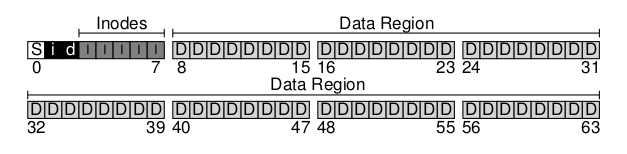

#### 1.2 File Organization: The Inode

inode是**index node**。这样叫的历史原因是因为一开始是用array来存储的，可以通过index来访问特定的inode。inode保存了一个文件的信息，如长度，访问权限以及连续块的位置。

每一个inode被一个数来refer，叫做i-number。给一个i-number，需要能够直接在硬盘中定位到这个inode的位置。

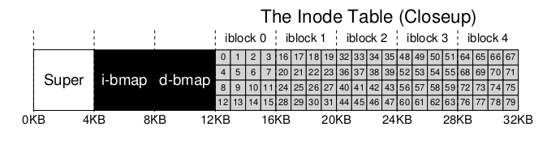

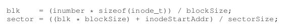

每个inode包含非常多的信息：文件类型，大小，blocks的数目，保护信息，一些时间信息，包括创建时间，最近修改时间，以及这个文件的数据块放在磁盘的哪个位置上。

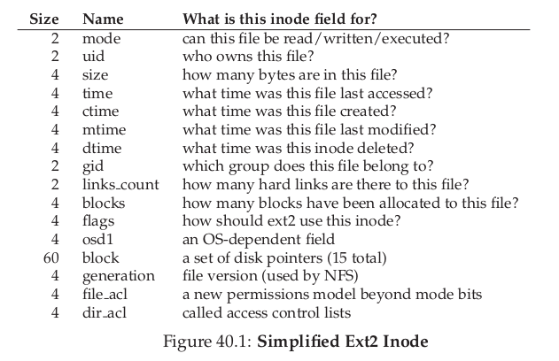

在设计inode时候最重要的是要决定如何保存这个文件数据块儿在哪儿。如果直接使用pointers来放在inode之中，那么这种方法是不好的，因为如何你的文件非常大，那么inode节点中放不下的话，那么就非常糟糕的。

为了解决上述的问题，使用的方法是**The Multi-Level Index**。首先在inode节点中保存了一些固定数目的直接pointers，然后如果文件足够大的话，最后一个叫做**indirect pointer**,这个指针指向一个block，这个块中包含的全部是pointer，指向这个文件的块儿的位置，如果还不够，可以这样以此类推。

另外一种方法使用的是**extent**的方式。这种方法采用的是一个disk pointer加上一个length。这样如果文件是连续的话，就能够减少使用的空间。通常一个inode之中不会只有一个extent，当磁盘中找不到连续的空间来存放文件的时候，就需要多个extent来保存文件。Linux 的ext4就是这种方法。

采用上面的多级索引的原因是大部分文件是非常小的。

另一种方法是使用linked list。在inode中只有一个pointer，这个指针指向第一个数据块，然后这个数据块的结尾会存放下一个数据块的pointer。

这种方法的主要的问题是效率太低，一种方法是将这些link的信息保存在一个数据块中，这个表每一个元素都是一个pointer。这种方式就是**FAT fiel system(file allocation table)**。

#### 1.3 Directory Organization

在Vsfs文件系统中，directories是一种非常简单的组织方式。一个目录包含一个列表，列表中是(entry name, inode number)pairs。对于这个目录下的每一个文件和文件夹，有一个字符串和数字在这个文件的数据块中。每一个string，也可能有一个长度和它对应(假设名字是变长的)。下面是一个目录结构的例子。

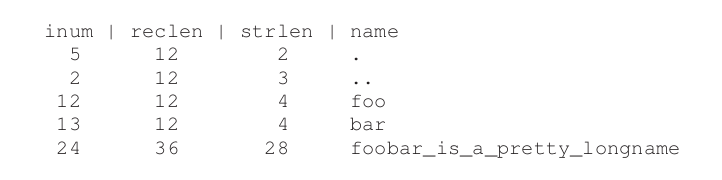

在上面的目录项中，每一项有一个inode号，记录长度(名字加上任何留下的空白空间的总字节数)，字符串长度，以及这个目录的名字。

删除一个文件可能会在目录中间留下一个空位，因此可能会需要有一些方式来标记这个目录项是否有效。(可以将inode number变成0)。这样的话record length就能够在一个文件或者目录被删除之后被重新利用。

目录被存在什么位置呢？目录页存在文件的inode 表中，但是会存在不同的区域，这一区域的inode都是目录，有些区域只存文件的inode。

当然目录元素用线性表来保存只是一种保存方式，任何能够保存数据的数据结构都可以用来保存目录项。

#### 1.4 Free Space Management

我们有inode的bitmap和data block的bitmap，这样就能够管理磁盘的空闲空间。要创建一个文件的时候，先找到一个可用的inode，然后找到可用的数据块，将对应的bit置成1，然后就可以进行使用了。

除了使用bitmap的方式，还可以使用其他的方式来管理空闲的空间。比兔B树等等。这是一个时空交换的trade-off。

#### 1.5 Access Paths: Reading and Writing

下面假设这个文件系统已经被挂载了，超级块已经在内存中。但是其他的东西都还在硬盘上。

- Reading A File From Disk

当操作系统想要读一个文件的时候，比如下面的路径`/foo/bar`，那么操作系统先找到根目录，根目录在Unix系统中的inode节点号是固定的，是2。然后通过2找到根节点的数据块，然后查找数据项，然后找到`foo`对应的inode，然后找到`foo`对应的数据块，依次类推，最终找到这个文件的inode。

在读的过程中不需要范文位图，但是在写的过程中需要先查找到空闲的数据块，然后更新位图，然后在将数据写入。

#### 1.6 Summary

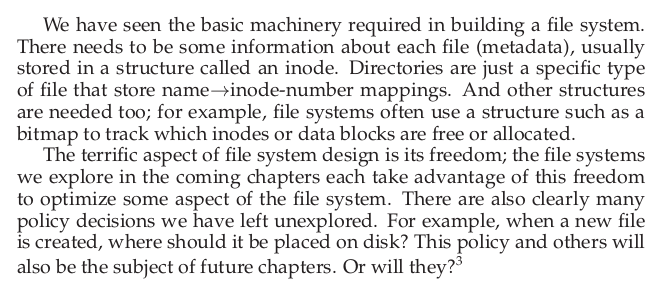

### 2 Locality and The Fast File System

当Unix操作系统第一次引入的时候，文件系统是非常简单的。

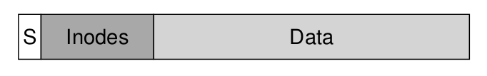

超级块包含了整个文件系统的信息：容量，与多少inode，空闲块列表的第一个头指针，和等等。inodes 区域包含了这个文件系统的所有的inode。然后剩下的部分存放数据。

#### 2.1 The Problem: Poor Performance

主要的问题是文件系统将硬盘看做一个随机访问存储器数据别分散地放在硬盘的各个地方，没有考虑到硬盘是如何存放读取信息的。所以这样一来，定位的消耗就非常大。比如inode和数据块之间隔得比较远，访问就比较麻烦。

而且文件系统最后会被分割的很严重。

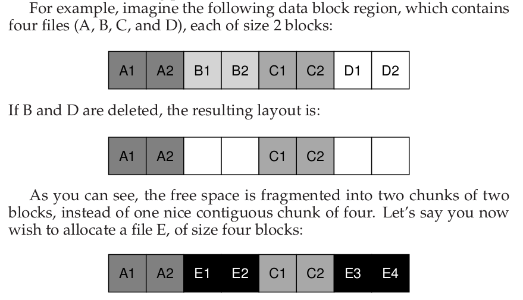

#### 2.2 FFS: Disk Awareness Is The Solution

为了解决上述问题，在不改变外部结构的情况下，保证各种系统调用不变，修改内部实现，来达到更高的性能。

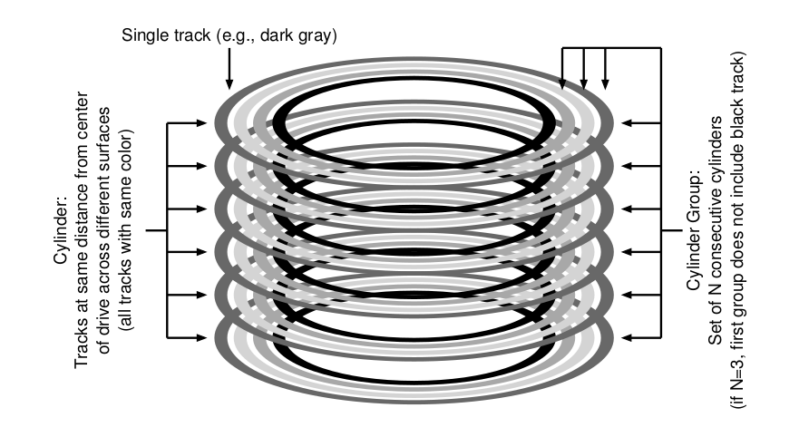

首选将磁盘分成很多磁柱，然后几个磁柱组成一个磁柱组。但是这些磁柱组在文件系统看来就是一个block group，就像下面一样。一个磁柱组中的数据在地址空间中是相连的。

FFS在每一个组中包含了非常多的信息。下面是一个组中的信息：

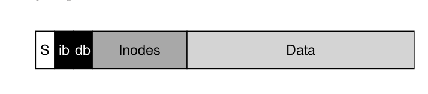

每一个组都会保存一个超级块的副本，同时每一个组也有自己的ib和db以及inodes和Data。他们都和前面的文件系统相类似。

#### 2.3 Policies: How To Allocate Files and Directories

最基本的策略就是将相关的东西放在一起。

对于文件的话，首先需要将这个文件和这个文件的inode放在一起，其次，将所有文件放在和这个文件所在目录一个磁柱中。 下面是一个例子。需要将`/a/b ,/a/c, /a/d, b/f `存放在这个文件系统中，那么就可以按照下面这样分配：

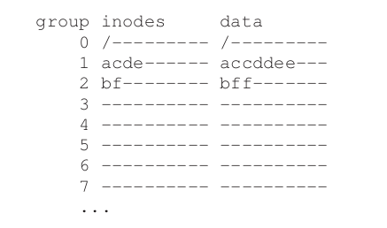

这个文件系统将每一个文件的数据块和这个文件的inode放在同一个磁柱区中，同时还将一个目录中的文件放在靠近的位置。

上面的策略的原理是一中**common sense**。一般放在一起的文件之间存在联系。

但是如果一个文件非常大，怎么办呢？一种自然的想法是先将一个磁柱区的数据块全部占完，然后再占下一个磁柱区的数据块。但是这种方法是不好的，因为这样一来，如果这个文件夹下面还需要创建新的文件，那么这种方法就没法保证放在同一个磁柱区中，这样效率就会降低。一种策略是设置一个最大的数量，如果一个文件的数据块超过这个数量，那么就到下一个磁柱区。

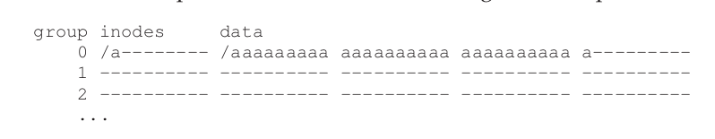

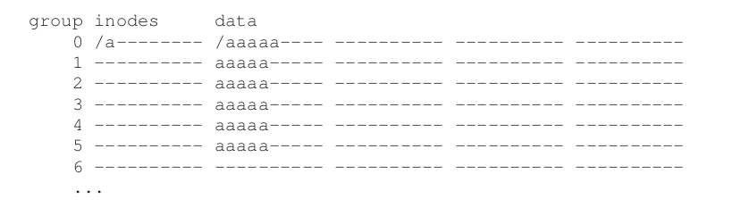

这个最大的数量如何确定呢，如果比较小的话，那么主要的时间用来寻址，如果比较大的话，主要的时间用来变换数据。

#### 2.4 Summary

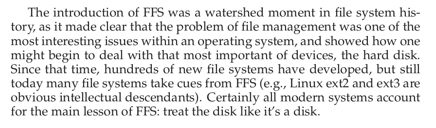