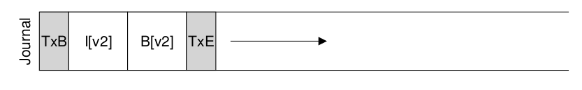
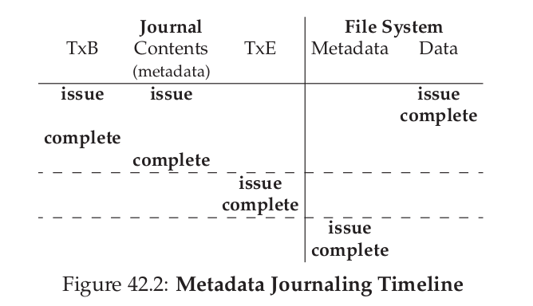

## 操作系统
## 王道烩 2018.10.12

### 1 Crash Consistency: FSCK and Journaling

在磁盘工作的时候，会遇到各种突发得的情况，如突然断电，或者系统崩溃。这个时候会导致文件系统存在一个问题，称为** crash-consistency problem**。而且这种突发情况可能在任何时刻发生。如果在写数据的时候发生crash，那么这个文件系统就存在问题。

解决这种问题有两种方法，一种方法是**file system checker**，还有一种方法是**journaling**。

下面是一个例子。

如果想要在这个文件中添加一些内容，那么想要的结果是下面这种：

但是不能够一下子将所有信息都写入磁盘，每次只能执行一个写操作。比如写bit-map，或者写inodes，或者写Data Block。这样的话就会发生下面这些中情况：

- 只写了data block。这样的话相当于没有写，没有关系。
- 只写了inode。这样的话如果访问文件的时候，会得到无效的信息。这个时候有一个内部冲突，inode说这个数据块用了，但是bitmap说这个数据块没有被使用。这个问题需要被解决。
- 只写了bitmap。如果bitmap表示5被分配了，但是没有inode指向这个数据块，那么这个时候这块空间就不会被别的文件再使用。

- 写了inode和bitmap。这个时候文件系统的信息数据是完全一致的，就是bitmap和inode信息是一致的，但是数据没有别写入，这个时候只会得到无效信息。
- 写了inode和data block。这和前面值写了inode的问题是一样的，需要解决。
- 写了bitmap和data block。这个时候这个数据块不属于任何一个文件，因为没有指针指向这个数据块。

#### 1.1 Solution #1: The File System Checker

早期的文件系统使用一种比较简单的方法。它允许不一致发生，然后在去fix它。有种工具是**fsck**。但是这种工具仅仅使这个文件系统自己决定自己是一致的。**metadata**。

fsck在将磁盘挂载到系统中之前进行操作。下面是fsck做的基本操作：

- Superblock：首先检查超级块是不是合理的。如检查已分配的数据块加起来大小是否比整个磁盘还大或者是否所有的超级快是相同的。
- Free blocks：然后扫描所有的inode，indirect blocks, double indirect blocks等等，来建立一个自己对现在文件系统中哪些块被分配的理解，然后利用自己的理解来得到自己认为正确的bitmap，如果系统的bitmap不一致，那么就修改系统的bitmap。
- Inode state：fsck需要保证每一个inode都要有正确的内容，或者文件，或者目录，或者链接，如果没有的话，那么就将这个抹除，并修改相应的bitmap。
- Inode links：fsck会扫描整个文件系统，然后统计每一个文件的链接数，如果和inode里面的连接数不一致，那么就将这个inode里面的信息修改。如果一个inode没有目录包含，那么就将这个文件移动到**lost+found**中。
- Duplicates：如果一个数据块被两个文件指向，那么将这个数据块给每一个文件备份一份。
- Bad blocks：如果一个指正明显超出了范围，那么就将这个pointer删除。
- Directory checks：虽然不能够理解文件的内容，但是目录的内容是文件系统自己设计的，所有文件系统可以理解目录的内容。如果发现有不合法的目录项，那么就将这个目录向删除，同时一个目录在整个目录树中不可能被链接超过一次。

但是这种方法的效率是非常低的。如果磁盘容量非常大，那么会非常消耗时间。同事如果一个文件系统只有很少文件，那么扫描这个磁盘是非常不划算的。

#### 1.2 Solution #2: Journaling (or Write-Ahead Logging)

为了解决上面效率太低的问题，可以使用写log的方法，如果想要写一个内容，那么不直接就写在对应的磁盘上，而是现在另一个地方写一个log文件，然后再将这个log文件写到对应的磁盘上。如果在写磁盘的时候发生断电，那么上电的时候可以通过查这个log文件，然后将对应的内容恢复。

没有log的文件和有log文件的文件系统可能是下面这样的：

当需要写内容的时候，先将下面的内容写到Journal区域：

然后在将这个内容全部写到Journal区域之后，进行的操作叫做：**checkpointing**。就是将Journal区域的内容真正写到磁盘对应的位置上。

但是上面的还是存在问题，如果我们将上面的五块内容写到磁盘，但是写的顺序我们是不知道的，是磁盘自己调度的，如果先将除了Db数据块的其他内容写入了，但是Db写入的时候掉电了，这个时候在上电的时候，就会将垃圾数据写到对应的磁盘中，为了解决这样的问题，可以现将前四块数据写到Journal，在确定写入之后，再将最后的结尾控制符TxE写入，这样就可以保证写入的是正确的数据，同时为了保证TxE完整的写入，需要写的TxE是一个原子操作。一个磁盘一次写的数据是512Byte，所以可以将TxE设置为512BxT，这样就能够保证写TxE是原子操作了。

我们能够拥有的Journal区域的大小是有限的，所以在将一个内容写到磁盘中之后，可以将这一块区域释放，只需要增加简单的标记位即可。可以在Journal中添加Journal超级快，里面存放两个指针指向使用的区域，其他区域都是free的。

所以整个过程如下所示：

但是上面的方法效率还是很低，我们如果想要写一个东西的话，相当于要在磁盘上写两次，这样的话，带宽会降低一半，如果是连续写操作的话效率会非常受影响。所以我们可以不将数据写入Journal中，只讲控制信息写到Journal中。

具体操作是，我们先将数据直接写到磁盘上，然后将metadata写到Journal中，然后将Journal中的信息写到磁盘上，这样就能够不需要将数据写两遍。

具体的两种操作的timeline如下所示：

#### 1.3 Summary

### 2 Flash-based SSDs

**solid-state storage devices**。固态硬盘。

Flash chips设计和DRAM类似，不是使用磁性材料来存储信息，而是使用晶体管来存储信息。同时一个cell存储的bit位可能不止一位，可以表示两个bit或者三个bit。
然后可以将这些bit组织成两个不同大小的单位**blocks和pages**。blocks的大小一般是128KB或者256KB，page的大小一般是4KB。同时还有bank。一个bank有很多block，一个block也有很多page，如下所示：

对于Flash的基本的操作有三类：Read,Erase,Program。

- Read(a page)：读操作是以page为单位的，而且固态硬盘没有机械的磁头，不需要寻道时间和旋转时间，可以实现随机访问。所以会比固态硬盘快很多。

- Erase(a block)：在write一个flash中的一个page之前，这个设备的自然属性需要先将这个page所在的block全部erase，然后才能够写入。所以在写一个page之前徐娅先将这个page所在的block全部存到另外一个位置，然后在写入。

- Program( a page)：在erase之后，写操作是可以一个page为单位进行写的。当erase之后，这个block的全部bit都是1。

下面是一个流程的示意图：

但是固态硬盘面临的问题是，写的次数是有限的，一个固态硬盘如果某个block损坏，那么整个硬盘都会损坏，所以固态硬盘面临的一个问题就是负载均衡的问题。

### 2.1 From Raw Flash to Flash-Based SSDs

我们需要所有的硬盘的借口对于电脑来说是不变的，所以将一些Flash合成一个SSD，我们需要将借口之间进行转换，**flash translation layer(FTL)**，来实现将一组flash chips变成一个传统的存储设备。它接受来自顶层的对于一个logical page的读写，然后将其转换成底层的对于physical block和physical page的read erase program。

#### 2.2 FTL Organization

一种比较naive的想法是进行直接的映射，这种方法会降低固态硬盘的寿命。不适合使用。现在常使用的方法是**log structured**。如果需要写的话，系统直接写下一个free的空间，同时内存中有一个**mapping table**。或者在内存中，或者在硬盘中。这个table存储每一个logical block在物理地址中的位置。

但是这种方法面临这垃圾回收的问题。如果我们修改了a1和a2，然后将这两个c1和c2中，如下所示，那么a1 和a2 就是garbage。

这样做的方式就是将有用的信息都存在在一起，如下所示：

#### 2.3 Mapping Table Size

如果对每一个page保存上面的映射的话，那么对于内存的占用实在是太高了。所以可以使用对每一个block进行保存上面的映射，然后将offset加到后面，就可以得到真正的page地址。

但是如果此时只修改这个block中的一个page该怎么办呢？这个时候需要将整个block读出来，然后修改，然后重新写到下一个free的空间中，如下所示：

这样未免会损失效率，所以一种方法是将上面两种方法结合起来，保存一些block的映射以及一些page的映射。page映射称为log table，block的映射称为data table。当寻找一个特定的page时，首先在log table中找，找不到在data table中寻找。这种方法主要的问题是要找到能够合并的block然后将其用一个pointer进行表示。

这种只是将一个block进行合并叫做partial merge，还有一种是full merge。这种方式如下：如果需要将logical block0,4,8,12写到log block A中，那么就需要先找到1 2 3 ，然后将这些和0放到一个block中，然后在data table中存放这个映射，然后找到logicla 5 6 7，然后和4放到一个block中。这样是非常降低效率的。

还有一种方法是page mapping plus caching。这种方法只是将最近需要的page的映射保存到内存中，如果不需要的话，就不放在内存中。

其实上面的操作方式已经保证了整个硬盘的写次数是均匀的。每次进行写或者修改的时候，都是找后面一个空闲的空间来进行操作，这样就能够保证不会对一部分区域进行反复的写操作。

#### 2.4 Summary

