## 操作系统(二)
## 王道烩  2018.9.20

进程是操作系统提供用户的第一个抽象。进程简单来说就是运行中的程序。操作系统通过运行一个进程一会儿，然后停下它并运行另一个进程这样循环往复。这样CPU就能够被虚拟化为很多CPU，允许用户能够同时运行很多的进程。 这种技术称为**time sharing**。但是这样做的弊端就是会降低每个程序运行的性能。

为了能够实现这种虚拟化，OS需要两种层次的技术。一种技术是low-level的技术，这种技术主要负责**上下文交换**，这使得OS能够停止运行一个程序然后开始运行另外一个程序。另一种是比较高级的策略，称为policies.他是一种算法来做一些决定来决定哪种程序先在CPU上执行。这称为**scheduling ploicies**。

### Process

操作系统运行一个程序做的抽象一般称作**进程**。
在执行一段程序的时候，计算机的哪些部分是重要的呢？

首先是一个进程的**Memory**。程序的指令存储在内存中，程序使用的数据也存储在内存中。所以一个程序的地址空间是这个进程中的一部分。

第二，一个进程的机器装态的一部分是它的**寄存器(register)**。很多指令会度读或者更新寄存器，所以寄存器对于进程的运行也是十分重要的。有些寄存器是一些特殊的寄存器。如**PC(Program counter)**告诉我们这个程序正在运行哪条指令,**stack pointer**和**frame pointer**是用来管理栈用来函数参数，局部变量以及返回地址。

最后，程序通常需要方位永久存储设备，所以**I/O**信息可能包含一个进程目前正在打开的设备信息。

### Process API

在现代的操作系统中，一些常用的关于进程的API都是提供的：

- Create.创建进程
- Destory.强制销毁进程
- Wait.等待
- Miscellaneous Control.挂起进程
- Status.关于进程的状态信息，可以通过一些API获得。

### Process Creation:A Little More Detail

OS如何让一个代码能够运行的呢，进程真正地在做什么？

首先操作系统要将它的代码和静态数据加载到内存中这个进程的地址空间中。程序一开始在硬盘中，操作系统将他们加载到内存中。在现代操作系统中，只有当程序需要执行的时候，它才会被加载到内存中。这涉及到内存的**页面交换**.

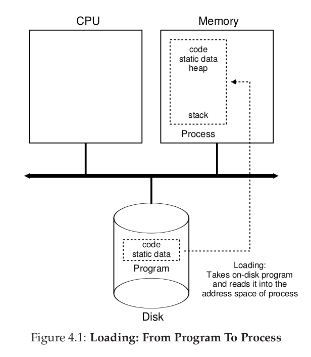

一旦代码和静态数据加载到内存中，同时需要**stack**空间来运行进程。C 语言代码使用栈来保存局部变量，函数参数以及函数返回地址。OS也可能会用一些参数来初始化stack。如main()函数的参数`argc` 和`argv`.

同时，OS需要分配一些内存给程序的**heap**.在C语言中，需要动态分配内存，如`malloc()`函数，这些堆的内存能够支持linked lists, hash table trees和其他的一些有趣的数据结构。堆一开始可能比较小，但是随着程序的运行，堆的大小会增长，所以OS需要分配足够多的内存来保证程序的运行。

同时OS需要做一些初始化工作，尤其是关于**I/O**操作。例如子啊UNIX操作系统中，每一个进程在创建的时候默认打开三个**file descriptors**,分别是`standard input ` ,`standard output`,`error`.这些描述符能够让程序能够从终端读取输入，向屏幕打印输出。

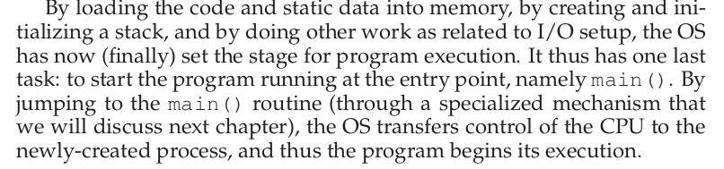

### Process States

一个进程能够有一下几个状态

- Running
- Ready
- Blocked

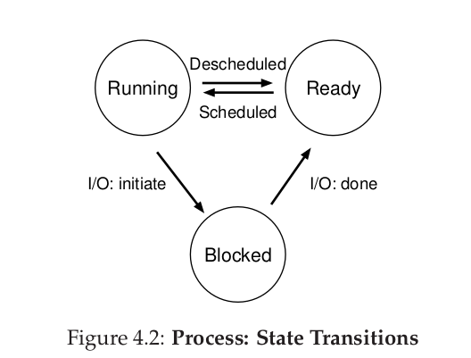

当一个进程被阻塞的时候，OS等待着一些事情发生，当发生之后，进程状态有Blocked,变成Ready.

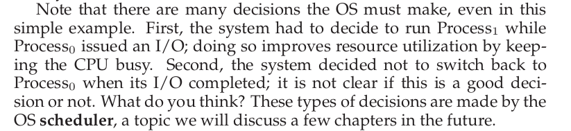

### Data Structures

OS也是一个程序，它也需要一些数据结构来跟踪各种信息。为了跟踪进程的状态，OS可能需要维护一个**process list**对于所有ready的进程以及一些额外的信息。

当OS停止一个进程运行的时候，寄存器内容需要保存到内存中。当再次运行的时候，需要将这些重新复原。这种技术称为**context switch(上下文交换)**

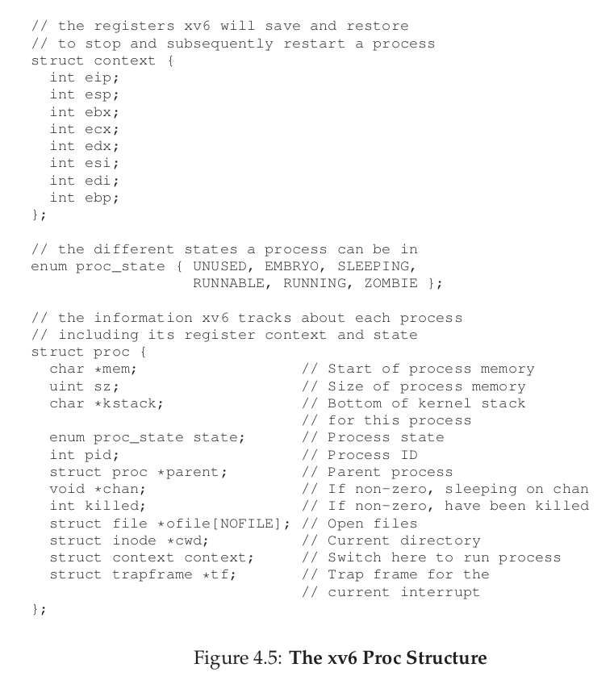

### Summary

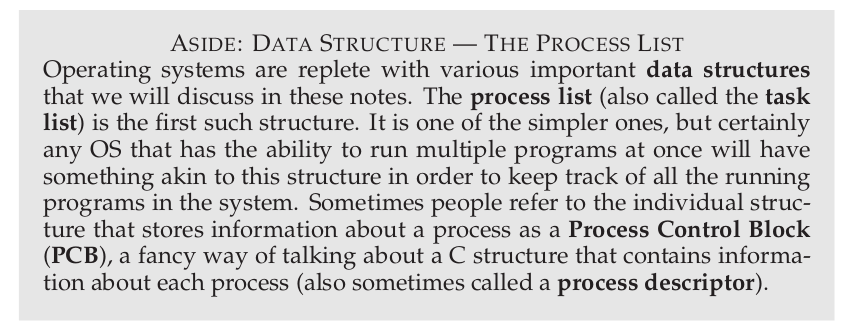

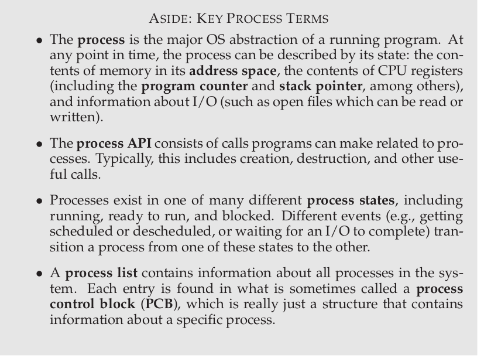

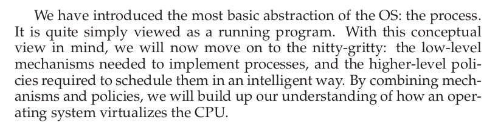

### Process API

#### fork()

`fork()`系统调用是创建一个新的进程，创建的进程是调用进程的一个副本，包括运行状态以及PC，也就是当前运行的指令是那一条，不同的是两个进程对于调用`fork()`函数的返回值是不同的。两个进程都是将要从`fork()`进程返回，子进程不会从`main()`开始执行，它就像刚刚调用了`fork()`一样。

但是子进程现在有了自己的地址空间，并不是和父进程共享地址空间的。但是子进程的`fork()`的返回值是不同的。父进程的`fork()`函数的返回值子进程的PID，子进程的返回值是0.这两个返回值可以供下面来实现不同的功能。

在调用了`fork()`之后，现在系统中存在了两个进程，这两个进程之间的执行顺序是不确定的。这就使得程序的执行结果有可能不同。这在**并发性**会详细讨论。

#### wait()

有时候父进程需要在子进程退出之后再退出，这个可以使用`wait()`系统调用。

当复进程调用`wait()`之后，就会延迟执行，当子进程结束之后，`wait()`返回给父进程。返回值是子进程的PID。

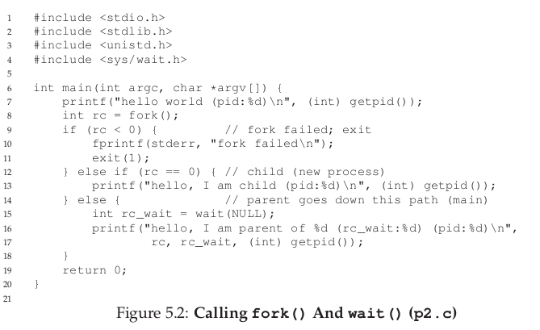

#### exec()

但是现在创建的进程只能够执行父进程的副本，如果想要执行新的程序，需要使用`exec()`系统调用。

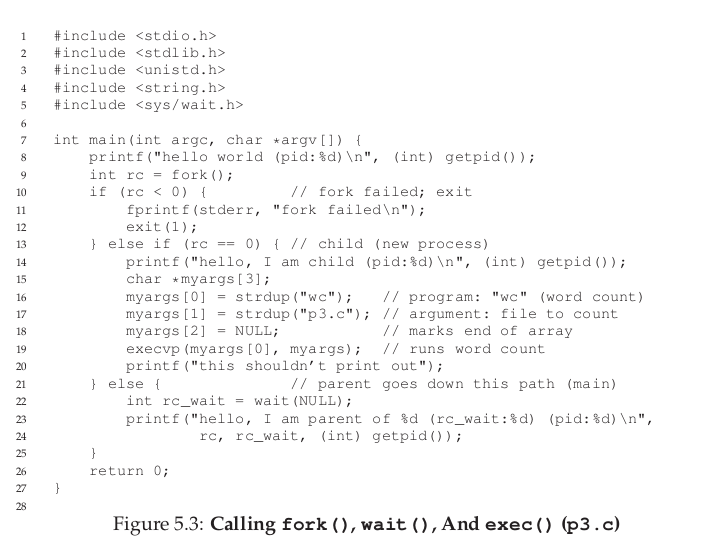

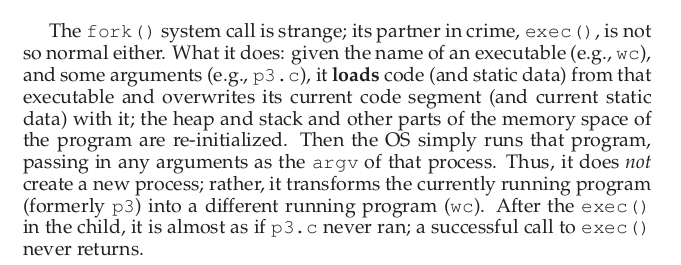

#### Why? Motivating The API

为什么我们需要这些系统调用嗯？因为在创建一个UNIX的shell的时候，这两者是必须的。它允许shell在执行完`fork()之后，在执行`exec()`之前，能够执行程序来改变将要运行的程序的环境，这能够增加很多特色。比如重定向。

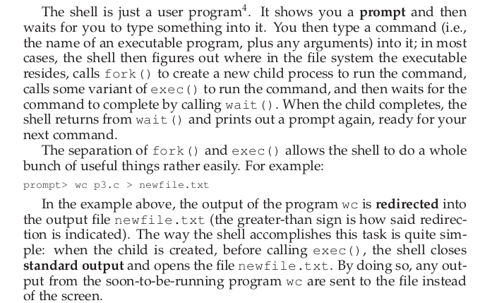

总的来说`fork()`和`exec()`组合是一个非常强大的工具，可以创造很多有趣的进程。

### Process Control And User

除了上面提到的三个系统调用之外，还有很多其他的关于进程的系统调用。例如，`kill()`系统调用可以用来向进程发送一些**signals**,在UNIX shell中，一些特定的快捷键也能够向正在运行的程序发送一些**signals**.

### Summary

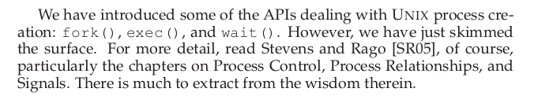

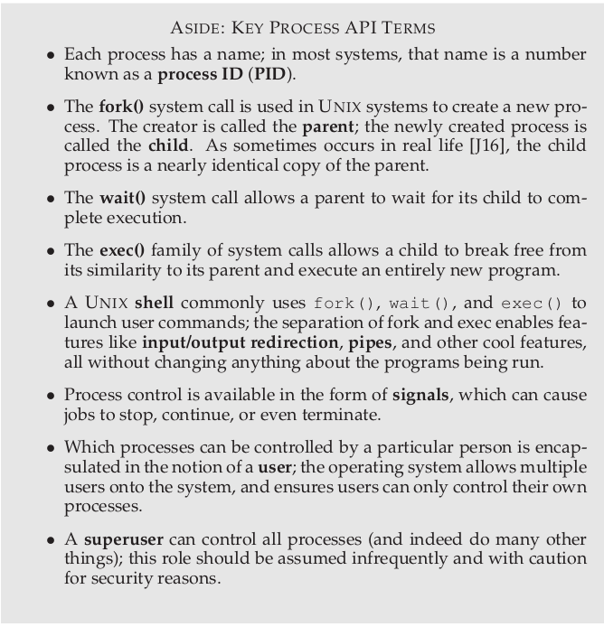

