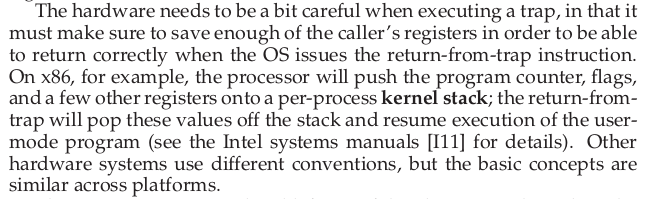
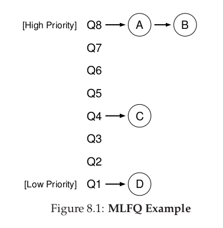

## 操作系统(三)
## 王道烩 2018.9.22

### 1 Mechanism: Limited Direct Execution

为了虚拟化内存，基本的想法就是**time sharing**。然而，这又面临着一些挑战。首先就是性能问题。我们在执行CPU虚拟化的时候怎样能够不为操作系统增加过多额外的负担？其次是控制问题。我们如何在能够掌控CPU的情况下来高效地执行程序呢？在保证对计算机的控制的基础上高效地执行程序是在创建一个操作系统时面临的一个巨大的挑战。

#### 1.1 Basic Technique: Limited Direct Execution

Direct execution指程序之间在CPU上运行指令，如果OS想要让一个程序运行，那么先在进程列表中构造一个进程元素，然后为他分配一个内存，将代码加载到内存中，定位程序入口，跳转到程序入口，然后开始执行用户程序。

但是这个过程导致了一些问题。首先，OS不能够确保这个程序做一些我门不希望做的事情。其次，OS无法终止这个程序的运行，从而切换到其他的进程。

#### 1.2 Restricted Operations

有一种方法能够让程序来做任何它想做的事情，比如I/O和其他相关操作。这种方法是，引入一种新的**处理器模式**,叫做**user  mode**。在用户模式下运行的代码能够执行的操作是有限的。例如在用户模式下，一个程序不能够执行I/O请求，不然的话处理器将会出发一个异常，然后OS有可能kill这个进程。

与user mode向对应的是**kernel mode**,这是操作系统运行的模式。在这种模式下，代码能够做任何事情，包括I/O请求以及任何类型的指令。

但是用户的程序如何能够做它被限制不能做的东西的呢？为了解决这个问题，操作系统为用户程序开发者提供了一套系统调用system call.系统调用能够让用户程序完成想要的功能，如进入文件系统，创建销毁进程，与其他进程交流，分配更多的内存等等。大部分操作系统提供了大量的系统调用。

为了执行系统调用，一个程序必须先执行特殊的陷入指令(trap instruction)。这个指令能够跳转到内核然后将优先级提升到kernel mode,然后执行需要执行的代码。当结束后，OS调用一种特殊的**return-from-trap**指令，返回calling的用户程序然后自动将优先级调整回用户模式。

但是还存在一个问题，trap怎么能够知道要运行OS的那个代码呢？肯定不能够让用户程序程序能够直接跳转到一个特定的地址，这样用户程序能够访问操作系统的空间，肯定是不安全的。

解决方法是在系统启动的时候，创建一个**trap table**。当机器启动的时候，操作系统配置硬件来初始化trap table。OS首先要做的第一件事就是告诉硬件当意外事件发生的时候需要执行什么代码。

为了区别不同的系统调用，每一个系统调用被分配了一个系统调用标号(system-call number)。

在上面的时间线中，我们假设每一个进程都有一个内核栈，当在不用模式下运行时用来存储寄存机的值。

#### 1.3 Switching Between Process

现在面临新的问题，当一个程序子啊CPU上运行的时候，OS并不在运行，那么OS如何能够将一个进程暂停来切换到另一个进程呢？OS如何能够重新获得CPU的控制权来切换进程呢？

##### 1.3.1 A Cooperative Apporach: Wait For System Calls

这种策略下OS信任用户程序会执行相应的系统调用来将CPU的控制权交给OS。这样系统通常会有一个yield 系统调用，这个系统调用什么都不做，只是将控制权交给OS。但这种方法显然不可取，如果用户程序陷入死循环，永远不调用这个系统调用，那么这个OS将会崩溃。

##### 1.3.2 A Non-Cooperative Approach: The OS Takes Control

在用户程序不友好的情况下，如何让OS获得CPU的控制权呢？如果只是通过软件的话，这种问题得不到解决。必须需要通过硬件来协助。

一个解决办法是设定一个计时器。这个计时器能够在一定的时间来产生一个中断，当中断发生时，CPU被OS控制，此时OS能够做自己想做的事情了，如进程切换。

当操作系统启动的时候开启计时器的时候，操作系统可以放心让用户程序执行，因为它知道它会得到CPU的控制权。

在时钟中断发生时，软件需要将当前正在运行的进程的状态入栈保存好，以便能够将来恢复进程，这和系统调用发生时硬件做的事情差不多。

##### 1.3.3 Saving and Restoring Context

在时钟中断发生的时候，OS需要决定是否继续执行当前进程或者切换到其他进程。这是调度算法需要解决的事情。如果决定需要切换进程，那么操作系统必须执行一种操作**上下文切换**。操作系统需要将当前正在执行的进程的寄存器的值保存到某些地方如内核栈中，然后将即将要运行的程序的一些寄存器的值加载到CPU中。

上述途中两次寄存器变化是不同的，时钟中断发生时，寄存器保存的操作是硬件执行的，但是再决定切换到B执行后，寄存器的切换是软件执行的。

但是如果在一个系统调用的时候发生了时钟中断该如何处理呢？一种解决的办法是禁止中断，但是关中断太长时间可能会导致问题。

#### 1.4 Summary

#### 1.5 如何测量操作系统系统调用和上下文切换的时间

首先，测量系统调用的时间比较简单，之间所测调用然后测量总时间，就可以了。但是测量上下文切换的时间比较困难。

一个方法是，开启两个进程，之间建立一个pipe。一个进程向这个pipe中写东西，然后就等待着读东西，然后另一个进程读东西，然后在写东西，然后再等待读东西。这样如果只有一个CPU的话，就能够在这两个进程之间不断进行切换了。然后用时间除以总切换次数，能够得到上下文切换的时间了。但是必须保证这两个进程在同一个CPU上运行，在多核计算机上可以使用某些指令来限制这一条件。

---

### 2 Scheduling: Introduction

在了解了底层的机制之后，我们需要了解操作系统的高层的一些策略。我们称为调度算法。(sheduling ploices)。

#### 2.1 Workload Assumptions

首先我门对进程的工作量做一些假设，然后再逐渐去掉这些假设，最终实现真正的调度算法。

- 每一个进程运行相同时间。
- 所有进程在同一时刻到达。
- 一旦开始，每个进程都运行一直到结束。
- 所有进程只使用CPU。
- 每个进程要运行的时间是已知的。

这些假设可能并不现实，但是方便我们对问题的分析。

#### 2.2 Scheduling Metrics(调度指标)

为了使问题简化，我们假设我们使用的只有一个衡量指标：**turnaround  time(周转时间)**。一个程序的周转时间是这个进程结束时刻减去到达时刻。

#### 2.3 First In, First Out(FIFO)

最简单的算法是FIFO。这种方法虽然简单，但是在某些情况并不好，比如如果一个运行时间较长的进程先到达，那么后序短进程都需要等这个长的进程完成之后才能够执行。

#### 2.4 Shortest Job First

为了解决上面的问题，自然可以想到最短工作优先的策略。但是这同样遇到一个问题，当一个较长的进程在运行的时候，这个时候来了较短的进程，此时总的情况并不是最优的。

#### 2.5 Shortest Time-to Completion First(STCF)

为了解决上述问题，可以使用最短完成时间优先的策略。

#### 2.6 A New Metric: Response Time

如果我们知道每一个进程的完成时间，那么STCF是一个非常好的算法，但是，分时操作系统引入之后，这个算法就不怎么好了。因为现在用户都在终端前面，和操作系统进行交互。因此，另一个衡量指标就显得尤为重要：**响应时间**。

响应时间是一个进程第一次被调度的时刻减去到达时刻。

很明显，上面的算法对于响应时间来说不是好的算法，一种比较好的算法是时间片轮转(Round Robin)

#### 2.7 Round Robin

RR的想法很简单，我们不是将一个进程运行完，而是将一个进程运行一个时间片，然后切换到下一个进程。

对于RR来说，时间片的长度是非常重要的。如果时间片短，对于我们的衡量指标响应时间是有利的，但是频繁的切换进程会使得上下文切换占据太多的时间，降低整体的性能。

RR对于周转时间来说效果是很差的。但是它是一个fair的算法，这确实是一个trade-off。

#### 2.8 Incorporating I/O

几乎所有的程序都要进程I/O操作，我门首先释放这条假设。

在一个进程执行I/O操作的时候，这个进程是不需要CPU的，这个进程因为I/O操作而被阻塞了。因此调度算法需要决定将那个进程激活。

当I/O完成的时候，产生中断之后，操作系统还需要来决定运行哪一个进程。

#### No More Oracle

现在我们需要解决的问题是，每个进程要运行的时间是已知的。这是一个最不现实的假设，我们如何在没有先验知识的情况下来设计一个比较好的调度算法，同时保留之前算法比较好的思想呢？这就是接下来的**多级反馈队列(Multi-level feedback queue)**。

#### Summary

### 3 Scheduling: The Multi-Level Feedback Queue

#### 3.1 Basic Rules

我们首先讨论一些基本的想法。

#### 3.2 How To Change Priority

##### Problems Now

#### 3.3 The Priority Boost

#### 3.4 Better Accounting

#### 3.5 Tuning MLFQ And Other Issues

#### 3.6 Summary

