## 操作系统(四) 
## 王道烩 2019.9.24

### 1. Sheduling: Proportional Share (比例共享)

接下来讨论一种比较调度算法叫做比例共享。这种算法的目的是保证每个工作得到特定百分比的CPU时间。

#### 1.1 Basic Concept: Tickets Response Your Share 

最简单的想法就是给每一个进程分配一个和其向对应的一个票数。(Tickets)。然后系统在每一次调度的时候都会生成一定范围的随机数，当这个随机数落在对应的进程的范围的时候，这个进程就会被调用。

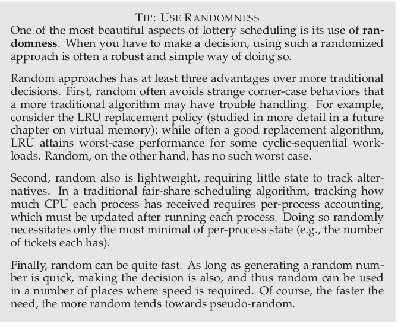

这样的话，在长时间来看，每个进程都会别分配到给定比例的CPU时间。

#### 1.2 Implementation

对于这种算法的实现方式可以使用链表这种数据结构。当拿到一个随机数的时候，从链表头开始加，然后当计数器的值超过这个随机数的时候，说明我们需要激活当前对应的进程。

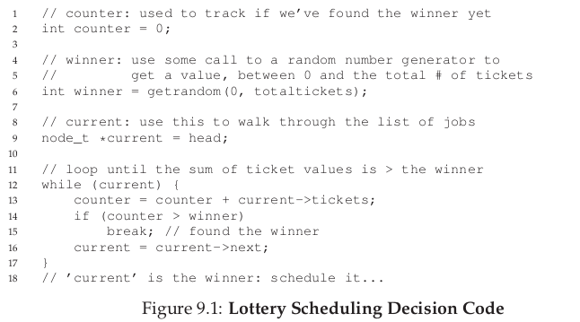

这里有一个小小的track。一般我们可以把票数比较高的那些进程放在链表的前面，然后将票数比较低的那些进程放在链表的后面，这样就能够尽量减少搜索时间。

#### 1.3 How To Assign Tickets?

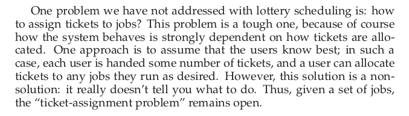

#### 1.4 Why Not Deterministic?

还有一种比较确定的算法，我们给每一个进程分配一个固定的步长，一个进程的票数越多，它的步长就越小。可以使用所有进程的票数的最小公倍数来除以他们对应的票数，就能够得到这个进程的步长。

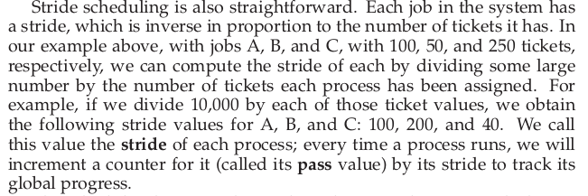

当我们进行调度的时候，每一个进程都有一个计数器，我们从计数器值中最小的那一个取出来运行，然后运行完一个固定的时间片之后，我们就将这个进程的计数器的值加上对应的步长(stride)。这样一来，在每一进程就计数器达到最小公倍数之前，就能够运行到自己对应的百分比的CPU时间。

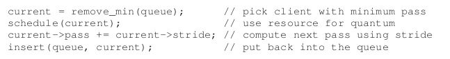

#### 1.5 上述两种方式的比较

既然我们能够使用第二种方式比较精确地来控制每个进程执行的百分比，那么为什么我们还要使用第一种随机算法来实现呢？

这里主要面临着这样一个问题。使用随机数是不需要变量来记录系统状态的。如果一个系统在运行的过程中，突然加入了一个新的进程，那么如果采用第二种方法的话，其他进程就会饥饿，这时候采用第一种方法就不会出现这个问题。

#### 1.6 The Linux Completely Fair Scheduler(CFS)

现在的Linux系统在这方面调度的时候主要使用的算法是CFS算法。

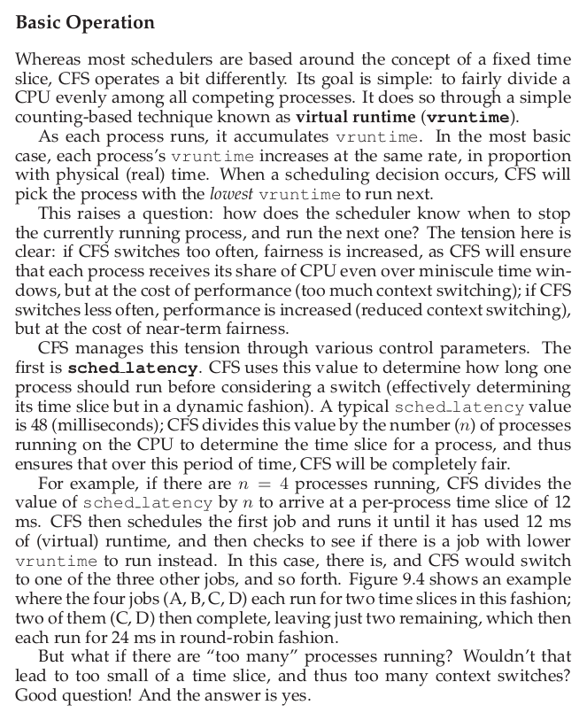

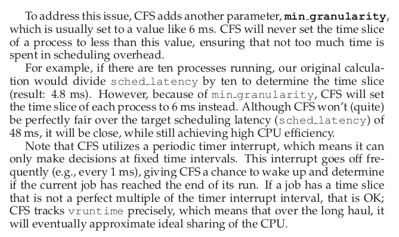

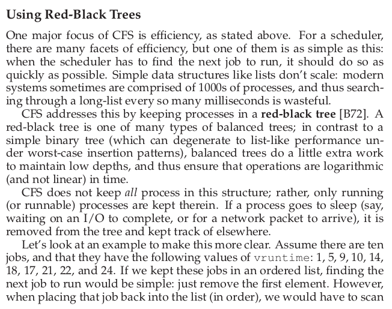

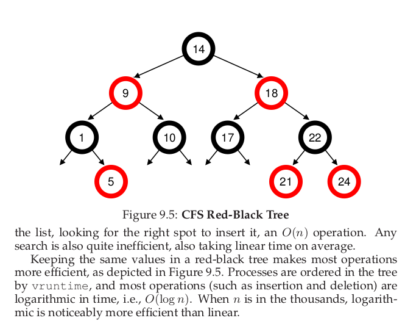

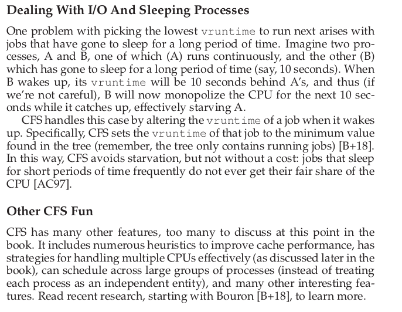

在执行某一个算法的时候，使用的数据结构是非常重要的。

#### 1.7 Summary

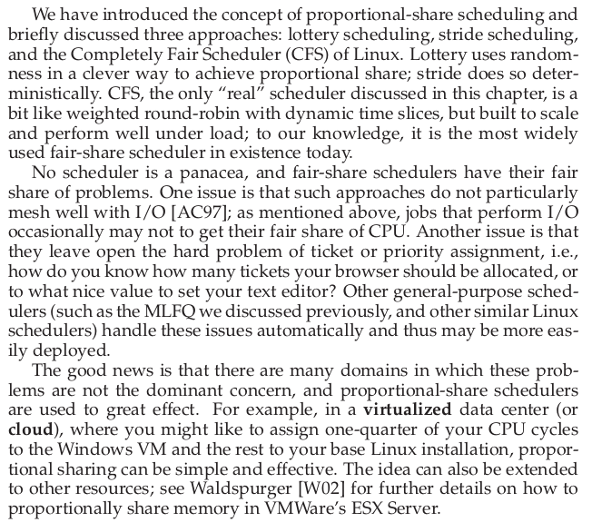

### 2 Multiprocessor Scheduling

待补充，在看完并发控制之后再来补充。

