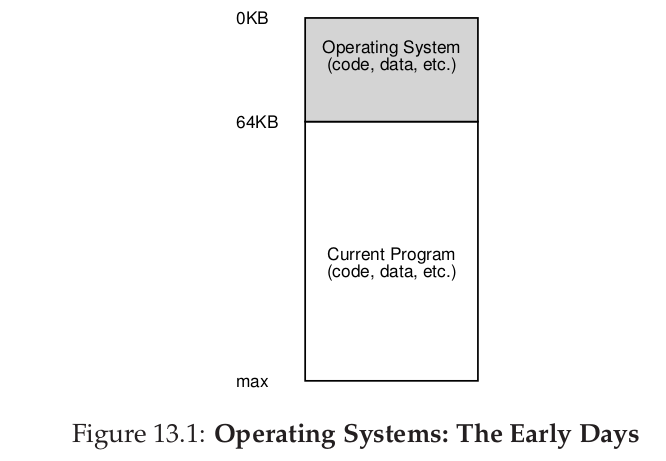

## 操作系统(五)
## 王道烩 
## 星期一, 24. 九月 2018 04:19下午 

### 1 The Abstraction: Address Spaces

#### 1.1 Early Systems

从内存的角度来看，早期的操作系统不用向用户提供虚拟化的内存。内存如下所示，OS在内存的低位，然后用户程序占据剩余的内存。用户对操作系统的要求不是很高。

#### 1.2 Multiprogramming and Time Sharing

随着操作系统的发展，人们的需求越来越高，此时需要多个进程同时在内存中存在，然后在不同进程之间进行调度。

但是这同时面临着一些新的问题，我们需要将各个进程之间进行保护，然后还需要将地址对程序员透明处理。

#### 1.3 The Address Space

为了让程序员不需要在写程序的时候考虑程序的地址问题，OS需要提供一种对于物理内存好用的抽象，地址空间(address space)。

上述地址空间是操作系统虚拟化出来的，叫做虚拟地址，真实的物理地址空间可能在任何地方。任何能够使用程序来打印出来的地址都是虚拟地址。

#### 1.4 Goals

- transparency(透明性) 真实的物理地址对程序来说应该是透明的。
- 效率 。为了实现快速地址转换，需要硬件辅助，如TLBs。
- Protection 操作系统应该保护不同进程之间的地址空间不能够相互访问。多个进程之间的地址空间应该被隔离开来。

#### 1.5 Summary

### 2 Mechanism: Address Translation

操作系统设计中，控制权与高效是两个主要的目标，通过软硬件结合，能够比较好的实现这两个目标，比如CPU的问题中。

操作系统主要通过地址映射来实现虚拟内存，将程序的虚拟地址通过硬件来进行映射，映射到其对应的物理地址，这样能够实现虚拟内存。

但是仅仅通过硬件还不足以解决问题，操作系统还需要跟踪那些地址是空闲的等等各种信息。

#### 2.1 Assumptions

- 用户程序的地址空间在物理地址空间是连续的。
- 虚拟地址空间比真实的物理地址空间小。
- 地址空间都是一样大的。

上述假设听起来比较不现实，但是随着问题的深入，这些假设都会一个一个消除。

#### 2.2 An Example

下面两幅图分别是虚拟地址空间和真是物理地址空间的情景

#### 2.3 Dynamic(Hardware-based) Relocation

为了实现地址转换，我们需要两个寄存器，base 和 bounds。

在OS将进程加载到内存中的时候，可以将这两个寄存器根据自己将进程放的位置来赋值。然后在寻址的时候，CPU将这base和虚拟地址相结合，然后判断是否越界，然后就能够将内存虚拟化。如果发生越界，CPU会产生一个中断，控制权交还给OS。两个寄存器结合，实现了简单安全而又高效的内存虚拟。

base 和 bounds寄存器是在芯片中的硬件结构，我们将处理器中进行地址转换的部分称为**内存管理单元(memory management unit MMU)。**

bounds寄存器有两种形式，一种是存放地址空间大小，另一种存放真实物理地址的结尾。通常使用前者。

#### 2.4 Hardware Support

- CPU需要有两种运行状态
- 硬件需要有base和bounds寄存器，能够将虚拟地址和base相加得到真是的物理地址。同时需要能够判断是够越界。
- 硬件需要提供特殊的指令来修改初始化这两个寄存器，而且只有kernel模式才能够运行。
- CPU在用户进程企图越界的情况下产生中断，将控制权交换给操作系统。

#### 2.5 Operation System Issues

除了硬件的支持，还需要操作系统的软件进行支持。

- 在进程创建的时候，操作系统需要为进程在内存中找到空闲空间来作为地址空间。
当一个进程创建时，OS会在一个数据结构中(free list)找到空闲空间，并将这个空间标记为used。
- 进程终止时，操作系统需要收回占用的内存地址。
- 在上下文切换的时候，操作系统需要做一些额外的工作来将base和bounds寄存器保存下来。并将即将运行的进程相对应的寄存器值归位。
- 当一个进程stop的时候，操作系统能够将这个进程的地址空间换一个位置，这个时候操作系统需要维护并修改相对应的base和bounds寄存器的值。
- 操作系统必须提供**exception handlers**。

下面是一个比较完整的时间段描述

#### 2.6 Summary

为了解决进程之间的空间不能够使用的问题，下面将要引入segmentation。

