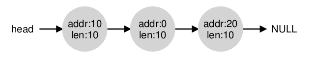
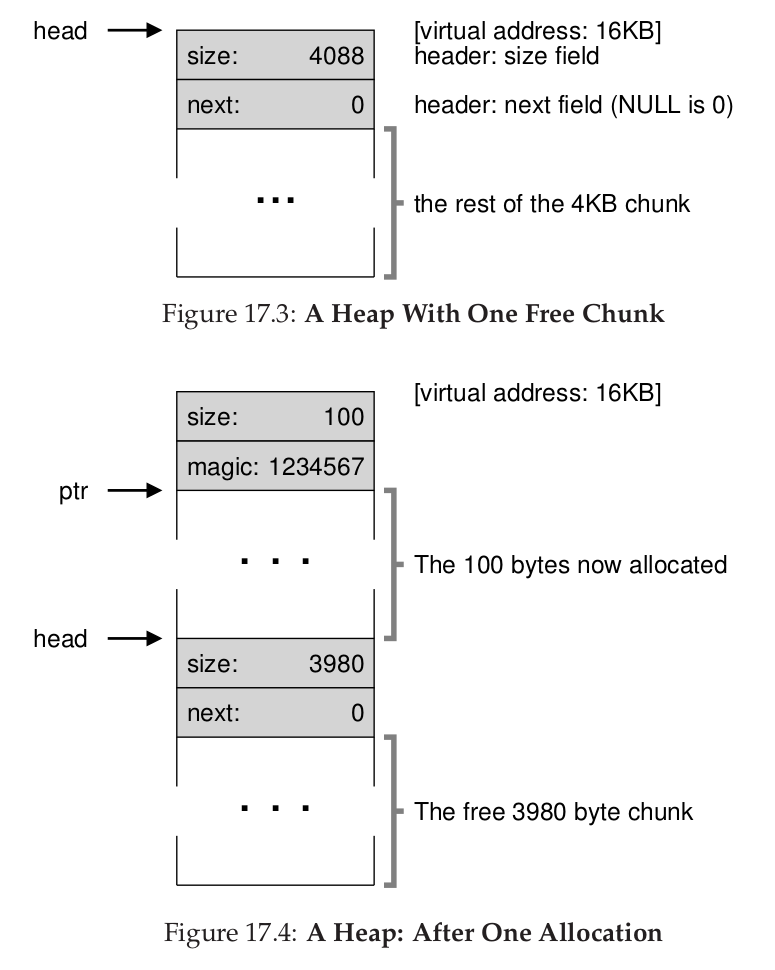

## 操作系统(六)
## 王道烩 2018.9.25

### 1 Segmentation

前面采取的方法对于地址空间是浪费的，比如栈和堆之间的空闲地址。同时还命令这这样一个问题，当这个地址空间不足以放的下整个虚拟地址空间的时候，进程就不能够运行了。

### 1.1 Segmentation: Generalized Base/Bounds

为了解决上述问题，我们可以采取一种分割的方法，将一个程序的三个部分：Code,heap stack分别放到不同的内存当中，然后对每一部分都设置一个base和bounds的值，这样就能够将三者分开，充分利用内存。

对于我们的MMU中的硬件结构，只需要保存一组三个base和bounds寄存器的值就可以了。

#### 1.2 Which Segmentation Are We Referring To ?

上述一共有三组寄存器值，那么怎么知道使用哪一组呢？一种解决方法是根据虚拟地址的高两位来判断要访问的地址是属于哪一个segmentation。有时将code和heap放在一起，那么就只需要最高位就可以判断。

#### 1.3 What About The Stack ?

三个部分中的code和heap的地址空间都是从低地址空间往高地址空间增加，但是stack是从高地址空间往低地址空间增长的，所以还需要一个bit来判断当前segmentation的增长方式

寻址的时候，先将自己的地址减去整个栈的空间大小，然后得到一个负数，然后再和base寄存器相加，就能够得到正确的物理地址。

#### 1.4 Support for Sharing

可以通过内存共享来更高效率的使用内存，可以在segmentation增加一些**信息位**，用来描述内存的权限。对于某些相同的代码，可以让多个进程进行访问，只需要将这一部分的权限设置为只读就可以。

#### 1.5 Fine-grained vs Coarse-grained(粗鲁的) Segmentation

#### 1.6 OS Support

对于上述操作，还需要一些OS的支持。

首先操作系统需要在上下文切换的时候将每一个进程的segmentations寄存器保存起来，其次，OS需要能够管理内存的空闲空间。通常的问题是当系统运行的时候，会出现很多的外部碎片，不同进程之间会产生一些空闲的比较小的空间。虽然可以将这些空间压缩，但是代价是非常昂贵的，可能需要消耗大量的CPU时间。

#### 1.7 Summary

### 2 Free-Space Management

这一部分先不讲虚拟内存管理，向讨论一下**空闲空间管理**方面的问题，这个问题是任何内存管理系统都要考虑的问题。

当考虑到内存分页的情况的时候，空闲空间管理就相当简单了。每一页都是固定大小的。只需要维护一个这些固定大小单位的列表，然后一个客户请求一块儿是，返回第一个空闲的即可。

但是当管理的内存包含各种大小的单元是，是非常困难的。主要的问题是外部碎片。即使存在的空闲空间加起来，能够满足需求，但是却不能够被使用。

在管理边长的内存需求的时候，什么样的策略能够尽量最小化fragmentation？相关算法的时间和空间复杂度又如何？

#### 2.1 Assumptions

这一部分的讨论主要是基于用户级的内存分配指令带来的问题。

在用户使用`malloc()`函数来申请内存时，需要执行需要的内存大小，但是在使用`free()`函数来释放内存的时候，却不需要指定内存大小，这种实现方式后面可以讨论。

上述函数使用的内存部分是堆，通常用来管理堆的空闲空间的数据结构是free list。

同时，我们假设一块内存别分配给一个进程之后，不能够再分配非另一个进程。

最后，假设请求的地址空间都是连续的，而且在生存周期内不会变化。

#### 2.2 Low-level Mechanisms

##### 2.2.1 Splitting and Coalescing

一个free list保存着现在操作系统内存中空闲的部分。如下所示：

当一个进行请求一块内存时，操作系统在free list中寻找一个比这个大小大的块儿，然后将一部分返回给请求这，剩下的仍然在list中。

但是当进程释放了一块内存，那么如何实现内存的合并呢？操作系统检查这块被释放的内存两边的空闲的内存能够进行合并。如果能够进行合并，那么就进行合并。

##### 2.2.2 Tracking The Size Of Allocated Regions

在调用`free()`函数进行释放内存的时候，不需要指定需要释放的内存的大小是多少。这是怎么实现的呢？

实际上在分配空间的时候需要额外的内存，见以下图示：

##### 2.2.3 Embedding A Free List

现在又有一个新的问题，我们如何来构建一个free list。因为如果想要创建一个新的节点的话，就需要使用`malloc()`函数，但是这样就会发生循环递归调用了。我们需要将这个free list嵌入到free spaces之中。

##### 2.2.4 Growing The Heap

当栈的空间用完了怎么办呢？现代操作系统在一开始会分配一个比较小的栈，然后随着进程的执行，如果栈的空间消耗完了，就会重新分配一个更大的栈。

#### 2.3 Basic Strategies

- Best Fit 找到最适合的内存分配。
- Worst Fit 找到最大的块来分配给进程。
- First Fit 找到第一个满足条件的块。
- Next Fit 找到第二个满足条件的块。

#### 2.4 Summary

