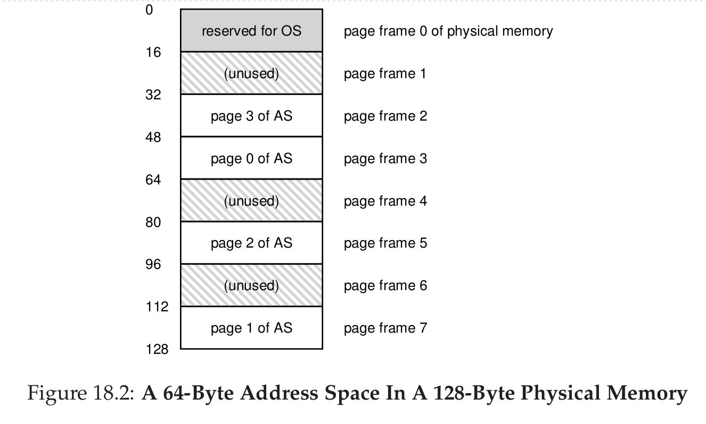
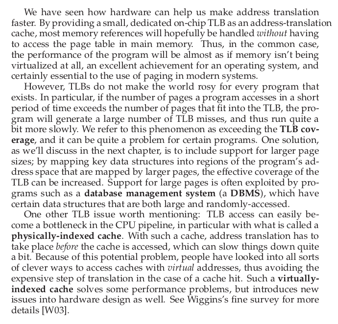

## 操作系统(七)
## 王道烩 2018.9.26

### 1.Paging: Introduction

操作系统为了解决上述问题，不再将一个进程的地址空间分成一些可变大小的部分(code, heap, stack)，而是将其地址空间切分成固定大小的单元，称作页(page)。相对应的，也可以将物理地址空间分成一组固定大小的块儿，称为**页框(page frames)**。每一个页框包含一个单独的虚拟地址空间的页。

上述图片是一个进程的虚拟地址空间。

然后将这些虚拟地址空间的页放到对应的物理地址空间的页框中，可得到上述图景。

为了知道某一个虚拟页放到物理地址空间的哪一个页框中，操作系统必须为每一个进程维护一个页表**(page table)**。页表的主要作用是进行地址转换。记住是每一个进程都有一个页表。

#### 1.1 A Simple Example
为了将进程产生的虚拟地址转换成物理地址，首先将虚拟地址拆分成两部分(virtual page number VPN)和页内偏移(offset)。如果有64字节的地址空间，那么虚拟地址一共六位，如果每一个页16字节，那么一共有四页，所以可以将虚拟地址的最高两位作为VPN,后面的四位作为页偏移。

有了虚拟地址的VPN，我们可以用来寻址，然后在页表中找到这一页对应的放在物理地址空间的页框号。然后将页框号 和页内偏移拼接起来，就能够得到正确的物理地址。

#### 1.2 Where Are Page Tables Stored

一个进程的page table到底放在哪里呢？一个32bit的操作系统，如果页大小是4KByte,那么VPN就是20bit，12比特的偏移量。20个bit的VPN意味着页表中需要有1M个，如果每一个**页表项(page table entry PTE)**需要四个bytes，那么一共需要4MB的内存。一个进程的页表就需要4MB的内存，那么这对于系统内存的消耗是非常大的。

因为页表太大了，所以不可能在CPU中把页表集成在CPU中，我们将页表放在操作系统的内存中，具体实现后面会详细讨论。

#### 1.3 What's Actually In The Page Table?

页表是一种将虚拟地址映射到物理地址的数据结构。最简单的一种数据结构就是一种**linear page table**，是一个array。OS直接将虚拟页号作为index，然后直接在array中进行查询，找到对应的物理框号。现在先使用这种比较简单的数据结构，之后可以使用更高级的数据结构来实现。

对于每一个page-table entry(PTE)，里面存了一些bit信息位。

- valid bit ： 表示当前转换是够有效。当一个进程在运行的时候，code和heap在地址空间的开始，stack在地址空间的结尾。在这两者之外的地址空间被标记为invalid。

- protection bits ：这些位表示了当前地址空间的权限：read,write,executed。

- present bit：表示一页是在内存中还是在磁盘中。

- dirty bit：表示当前页是否被修改过。

- reference bit：在页置换策略有用。

#### 1.4 Paging: Also Too Slow

在取对应地址的数据之前，系统必须首先从这个进程的页表中取页表项，然后执行转换，再从物理地址中加载数据。

首先硬件需要知道页表在什么位置，假设有一个页表基质寄存器保存了当前进程页表其起始位置的物理地址，为了找到想要的页表项，硬件需要执行以下运算：

找到了页表项之后，硬件取出PTE，从中取出PFN，然后加上偏移量，将虚拟地址变成物理地址。

#### 1.5 Summary

### 2. Paging: Faster Translation(TLBs)

使用页会加重系统额外的资源消耗。所以需要想一种方法来加快地址转换。

当系统需要加速的时候，往往需要硬件的支持。为了加速，需要一种**translation-lookaside buffer(TLB)**。TLB是芯片的内存管理单元MMU的一部分，仅仅是常用的虚拟地址到物理地址转换的一个硬件缓存。当一个虚拟地址过来的时候，硬件首先在TLB中进行查找，如果没有找到的话，在去查page table。

#### 2.1 TLB Basic Algorithm

如果硬件没有在TLB中找到，那么久先将其从内存中加载到TLB中，然后再重新寻找。在TLB中找到之后，地址转换的代价是非常小的，如果TLB miss，那么从内存中加载消耗是非常大的。

TLB的性能总结：

- TLB通过利用空间局部性(spatial locality)，能够提高命中率。
- TLB中页大小是非常重要的，页越大，命中率一般越高。
- TLB也可以利用时间局部性(temporal locality)来提高命中率。

当页表发生缺失的时候，是通过硬件来进行加载的。因此，硬件需要知道页表基址寄存器值，页表精确的格式，然后硬件找到对应的页表项，将内容更新到TLB中。现在的处理器多采用多级页表(multi-level page table)。

但是有些也是采用软件来解决页表缺失的，这个时候需要注意下面几个问题：

- 当发生页表缺失的时候，发生中断，但是操作系统在加载完页表之后，需要将这一条指令重新执行，但是如果是其他的系统调用的话需要执行下一条指令，所以发生中断时候的保存的PC值在两种情况下是不同的。

- 当操作系统在进行页表置换的时候，要避免连环缺失的情况。

- 软件实现页表加载是非常灵活而且非常简单的。硬件只需要产生一个中断，剩下的都交给软件就行。

RISC and CISC

TLB在实现的时候采用的是全联结(fully associative)的方法，一个页表项可以放在任何一个位置，在进行比对的时候，硬件并行地对TLB中的所有项进行比较，然后找到匹配的项。同时，还有一些other bits。如通常有一个**valid bit**。表示这个转化是够有效，**protected bits**表示这一个内存的读写执行的权限。如代码的地址是可读可执行，数据的权限是可读可写。

#### 2.2 TLB Issue: Context Switches

当发生进程切换的时候，每一个进程对应的地址转换肯定是不一样的，那么需要什么操作呢？最简单的方法就是将TLB中的内容全部置为无效，这样虽然能够解决问题，但是效率太低，当一个进程切换的时候，一开始都会发生缺失。还有一个方法是在TLB中添加一些位表示这个转换是那个进程使用的，称为**(address space identifier)(ASID)**。同时硬件还需要知道当前在CPU上运行的进程是哪一个进程，所以OS在进行上下文切换的时候，需要将当前进程的ASID设置给某些优先寄存器。

#### 2.3 Issue: Replacement Policy

- least-recently-used LRU.
- random

#### 2.4 Summary

