## 操作系统(八)
## 王道烩 2018.10.1

### 1 Paging: Smaller Tables

现在需要解决的问题就是页表的大小问题，，通过之前的讨论，我们知道一个进程的页表需要占很大的内存，所以需要找到一种将页表变小的方法。

#### 1.1 Simple Solution: Bigger Pages

一种最简单的方法就是增加页大小，这种方法能够降低虚拟页号和页框好的bit位数，但是问题是这样会使得内碎片变多，系统的内存会被快速沾满，所以现在操作系统一般的页大小就是4KB或者8KB。所以这种方法不是很适合。

#### 1.2 Hybrid Approach: Paging and Segments

在生活中如果对一些事情有两种都合理但是不同的方法，那么可以尝试将这两种方法结合起来来看看是否能够得到更好的解决方法。这种combination叫做hybird。

所以对于我们的内存管理来说，将segmentation和page table结合起来，可能会得到比较好的效果。

首先，我们将一个进程的虚拟地址空间分成三类，code，heap，stack。不是仅仅使用一个页表来管理整个地址空间，我们使用三个页表。

为了实现segmentation，我们需要base和bound寄存器。现在我们的base和bound寄存器不再指向真正的分割本身，而是指向对应部分的页表的物理地址。

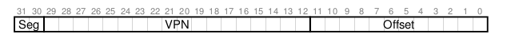

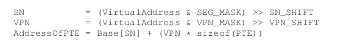

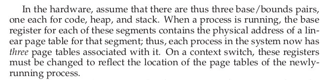

#### 1.3 Multi-level Page Tables

还有一种方法是使用多级列表的方法。这种方法将线性列表变成一种像树的结构。这种方法效率很高很多现代操作系统都使用这种方法。

多级页表的基本想法很简单，首先将页表切成页大小的单位，然后，如果某一整个页的页表项都是无效的，那么就不为这些页表项分配页。为了跟踪一个页表项所在的页是否是有效的，使用一个新的结构叫做页目录(page directory)。页目录是告诉你一个页表项所在的页在哪儿或者这个页表项所在的这个页都是无效的。

下面是一个例子：

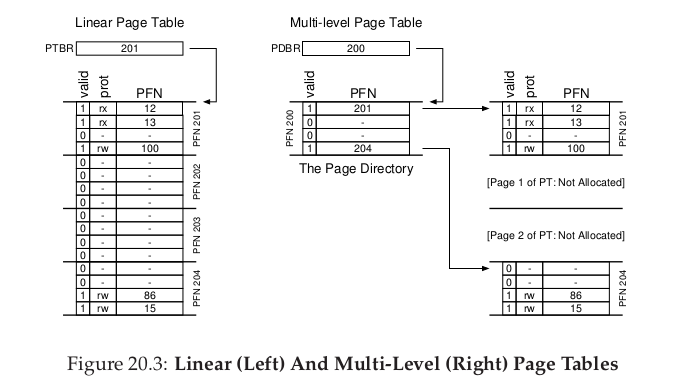

一个指针指向当前进程的页目录的起始地址，也就是物理页号200，然后找到页目录之后，页目录保存着是否有效以及对应的页框号。比如第一个项目有效，对饮所在的页号是201，然后物理页号为201的就保存了这个也中的页表项的信息。

多级页表的优势：

- 只对有效的元素分配页表项以及页。
- 能够更好地管理内存。
- 以前需要一块很大的连续的地址空间，现在可以将页表项放在任何位置。

多级页表的缺点：

- 时间消耗，以前只需要一级查询，现在需要多级查询。这是用时间换空间。(time-space trade-off)。
- 实现复杂。但是为了节省空间，复杂有时候是必须的。

##### A Detailed Multi-Level Example

假设虚拟地址空间是16KB，页大小为64B。所以有14位虚拟地址空间，8位是VPN(虚拟页号)，6位是offset。如果是线性表的话，需要256个元素，如下所示：

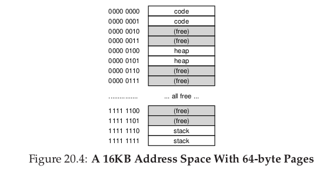

上图中，0,1表示code，4,5表示heap，254和255表示stack。

首先将连续的页表分成页大小的单元。假设一个页表项大小为4B，那么整个页表需要256*4B=1KB。页大小为64B，所以1KB的页表可以被分成16个64B，所以需要16个页来保存，每一页保存16个页表项(PTE)。

然后就需理解如何将一个虚拟地址分割为各个部分。首先，我们有16个页，所以页目录一共有16项，所以最高的4位用来页目录寻址，然后每一个页有16个页表项，所以剩下的高四位需要用来进行页表项寻址，然后剩下的6位做为offset。

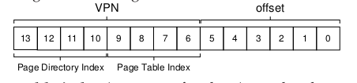

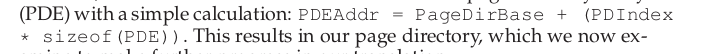

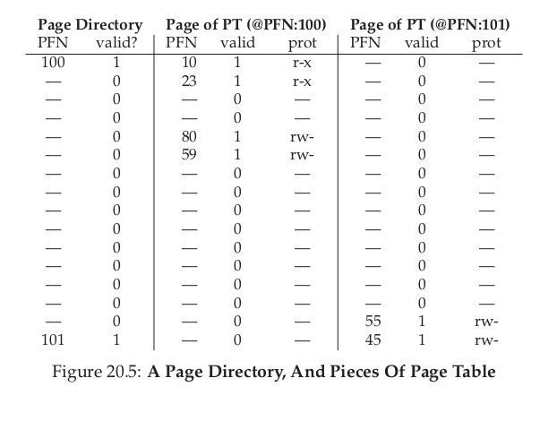

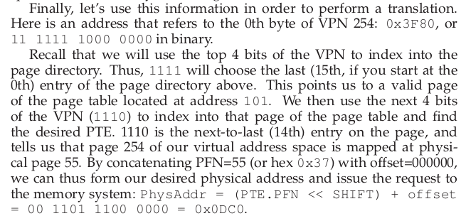

##### More Than Two Levels

当地址空间很大的时候，两级还是不够，会导致页目录的项数太多，所以可以使用多级页表，来减少不必要的内存空间。

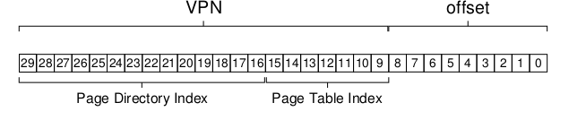

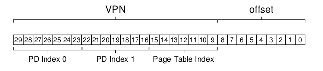

##### The Translation Process: Remember The TLB

为了总结整个二级页表的地址转换过程，下面将整个硬件执行的算法流程总结如下:

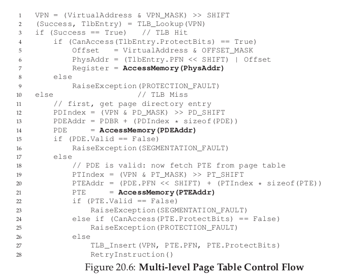

首先检查TLB，如果没有找到，然后查询二级页表，将其加载到TLB中，然后再次进行指令执行。

#### 1.4 Inverted Page Tables(倒排页表)

倒排页表的思想是，并不是为每一个进程维护一个页表，而是为整个真实的物理地址空间维护一个数据结构。其中的元素告诉我们那个进程在使用这个页框，以及哪一个虚拟页号映射到这个页框。

这样带来的问题是搜索，但是倒排页表只是一种数据结构，各种方式都能够实现，array，list，怎样实现取决于自己的目的。

#### 1.5 Swapping the Page Tables to Disk

如果同时将所有进程的页表都保存在内存当中，对内存的消耗还是太大了。一些操作系统将页表保存在**kernel virtual memory**中，允许操作系统来将这些页表中的一些swap到disk中。

#### 1.6 Summary

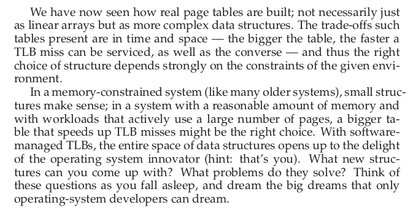

### 2 Beyond Physical Memory: Mechanisms

到目前位置，我们都假设进程的地址空间能够完全状态物理空间，计算机的内存足够大。但是现在的操作系统能够支持虚拟地址空间大于真实物理空间。这就需要在存储器体系结构中增加一层容量大，速度相对较慢的存储器hard disk drive。

除了仅仅支持一个进程的地址空间，交换空间(swap space)还使得操作系统能够为多个并行执行的进程提供大的虚拟内存。

#### 2.1 Swap Space

首先需要做的事情是在磁盘上开辟一些空间来用作页的移入和迁出。这些地址空间叫做交换区(swap space)。为了能够对交换区进行读写，操作系统需要记住每一个给定页在交换区的磁盘地址(disk address)。

其实操作系统不仅仅能够从交换区来定位。第一次运行一个程序的时候，程序的二级制代码都在disk中，然后被加载到内存中。

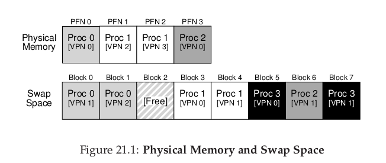

#### 2.2 The Present Bit

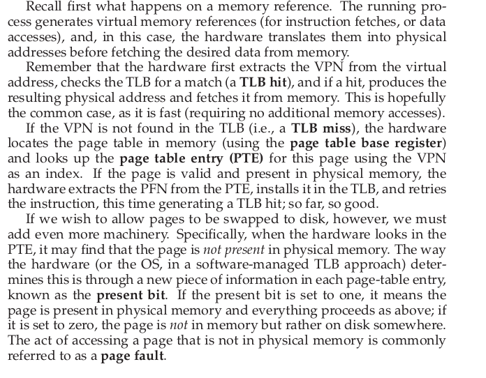

现在为了能够实现在memory和disk之间进行页交换，我门需要在页表项中添加一位**Present Bit**。这以为标记着这一页是保存在内存中还是硬盘中。如果在寻址的时候，发现这一页不在内存中，这种叫**页缺失(Page fault)**。当也确实发生的时候，操作系统需要干预来帮助解决页缺失。一段特定的代码**page-fault-handler**会运行然后解决页缺失。

#### 2.3 The Page Fault

当出现页缺失的时候，控制权会转交给操作系统。那么操作系统如何知道缺失的页在磁盘的哪个位置呢？这个时候页表项中的那些保存页框好的位就能够保存磁盘地址。操作系统可以通过那些位来找到地址。

然后操作系统可以执行I/O，但是这个操作是非常耗时间的，这个时候操作系统可以让别的程序执行，当I/O结束的时候，操作系统然后更新进程的PTE，然后进行程序的调度。

#### 2.4 What If Memory Is Full ?

当操作系统内存已经满的时候，需要将一些也置换出去，这个时候需要一些高效的**置换策略(page-replacement policy)**。下一份笔记将会详细介绍页置换策略。

#### 2.5 Page Fault Control Flow

下面是当需要寻址的时候发生的整个流程伪代码：

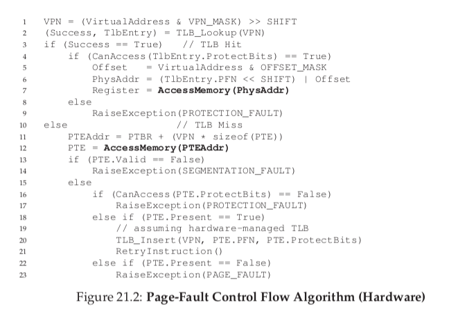

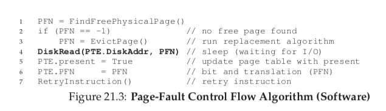

#### 2.6 When Replacements Really Occur

操作系统会有两个变量，一个是**high watermark(HW)**，一个是**low watermark(LW)**。当可用页少于LW的时候，操作系统会调用一个后台线程，来清理内存，直到可用页大于HW。

#### 2.7 Summary

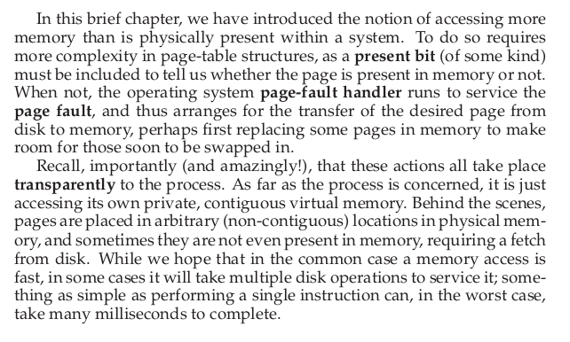

 