## 操作系统(九)
## 王道烩 2018.10.2

### 1 Beyond Physical Memory: Policies

当内存中没有足够多的页框能够使用的时候，如何决定将那一页置换出去是非常重要的。这称为**replacement policy**。

#### 1.1 Cache Managment

我们主要的认为是增加cache命中率或者说降低cache缺失率。平均访存时间有以下公式：

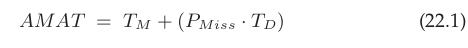

其中TM为访问内存的时间，PMiss为缺失率，TD为访问磁盘的时间。

#### 1.2 The Optimal Replacement Policy

首选考察最优的可能的情况，最好的替换策略就是将以后最远会使用的块儿替换出去。这虽然是一种最优的策略，但是却是无法实现的。但是这任然对于后面策略的提升最对比还是非常有帮助的。

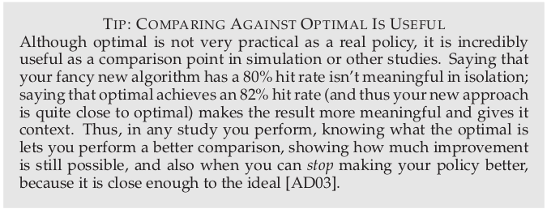

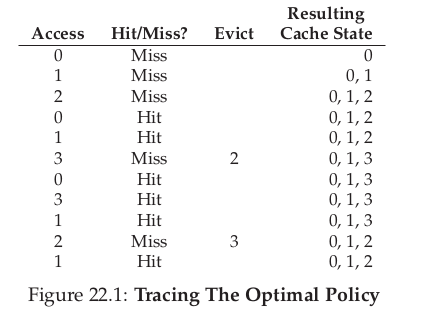

一开始的确实也称作**cold-start miss(冷启动缺失)**。

cache缺失的类型：

- 强制缺失(冷启动缺失)：一开始cache是空的。
- 容量缺失：因为cache容量被沾满了。
- 冲突缺失：由于关联度过低导致的缺失。但是OS的page cache不会，以为是全相联。

但是这种算法是不可以真正的实现的，因为不可能知道未来的事情。

#### 1.3 A simple Policy: FiFO

最简答的策略就是先入先出。

#### 1.4 Another Simple Policy: Random

还要一种简单的策略是随机。

#### 1.5 Using Hidtory: LRU

为了提升对未来的预测，我们可以利用过去学习，用历史来指导我们。

一种策略是将使用频率最低的替换出去。**Least-Frequently-Used(LFU)**。同时还有一种策略是**Least-Recently-Used(LRU)**，将最近最少使用的页替换出去。

#### 1.6 Workload Example

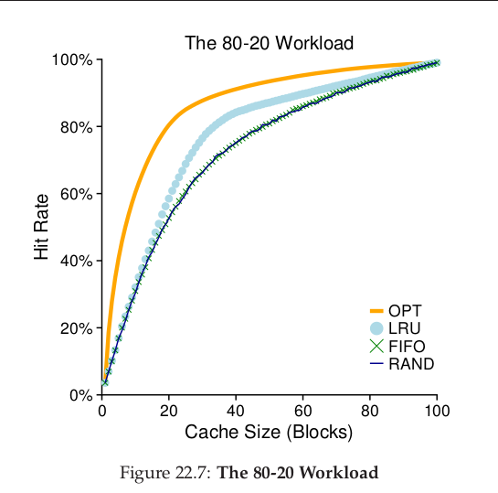

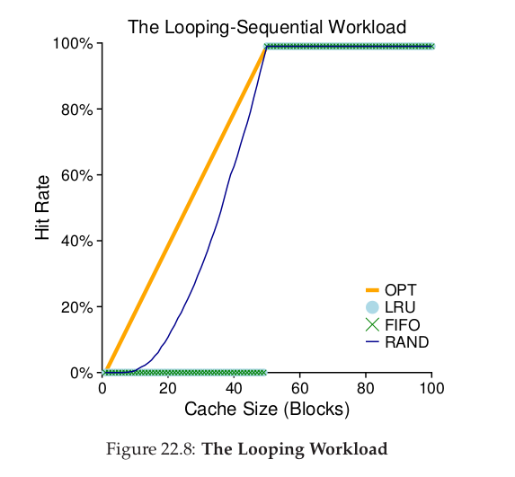

#### 1.7 Implementing Historical Algorithms

如何找打最近最少使用的页呢？现在操作系统的页数是非常多的，可以在一个数据结构中保存一个页最后访问的时间，然后再扫描一遍所有的页，找到时间最远的。但是这种方法的效率还是太低了，如何能够找到一种这种方法的近似，而不是真正找到绝对最远的那个页呢？

#### 1.8 Approximating LRU

对LRU的近似是现代操作系统主要采取的方法。这中方法需要硬件的支持，以一种**use bit**的形式。

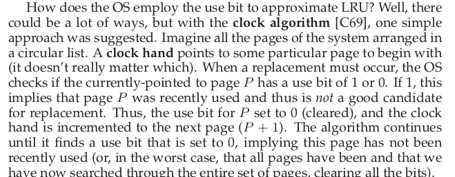

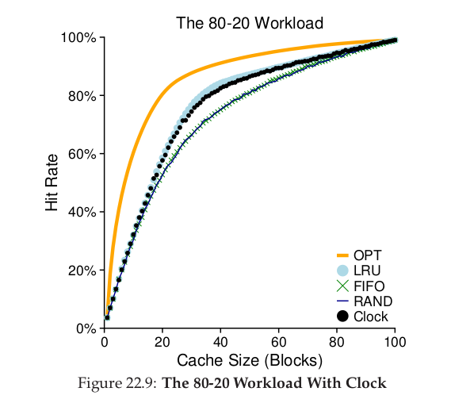

#### 1.9 Considering Dirty Pages

还需要增加以为来记录当前页是否被修改，如果被修改，那么替换出去的时候需要置换，如果没有被修改，那么可以直接被覆盖。

#### 1.10 Summary

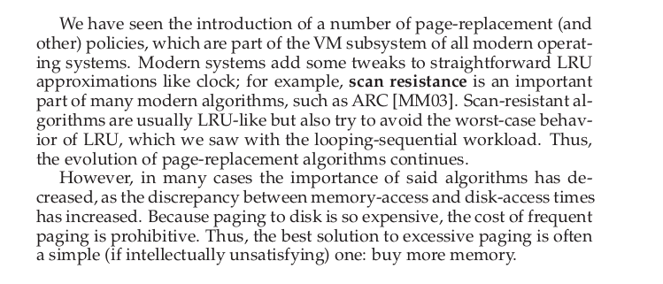

### 2 The Linux Virtual Memory System

#### 2.1 The Linux Address Space

Linux的虚拟地址空间包含一个用户portion(where user program code ,stack , heap , and other parts reside)和一个内核portion(where kernel code, stacks, heap, and other parts reside)。

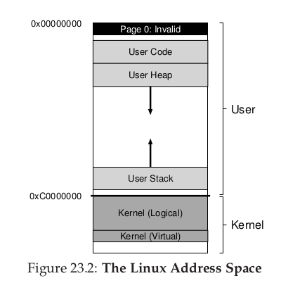

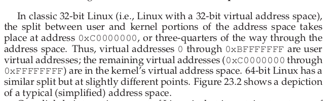

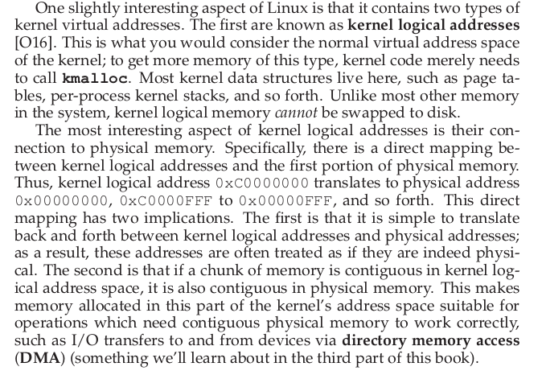

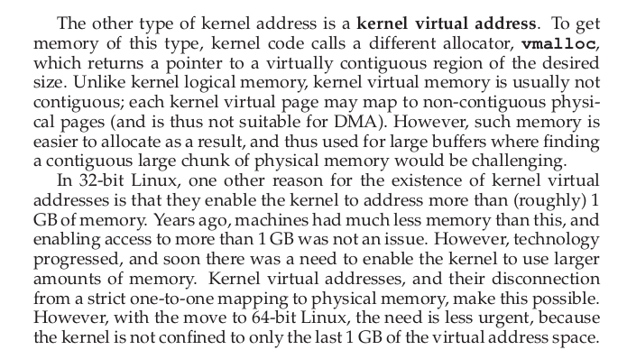

